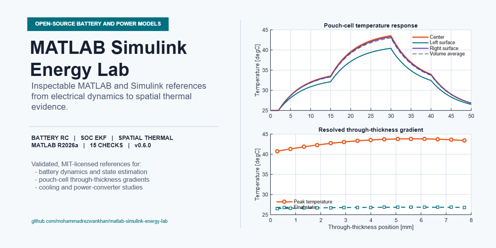
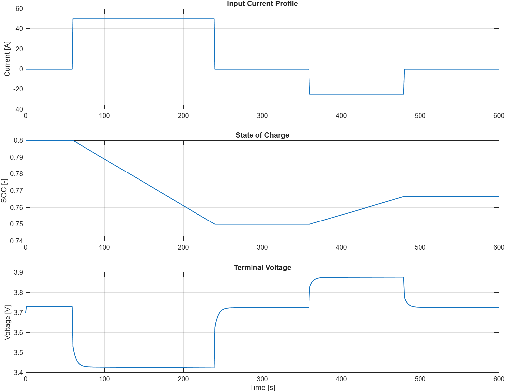

<!-- markdownlint-disable MD013 -->

# ⚡ MATLAB Simulink Energy Lab

[](https://github.com/mohammadrezwankhan/matlab-simulink-energy-lab/actions/workflows/markdown-maintenance.yml)
[](https://github.com/mohammadrezwankhan/matlab-simulink-energy-lab/actions/workflows/matlab-validation.yml)

[](https://github.com/mohammadrezwankhan/matlab-simulink-energy-lab/releases/latest)
[](LICENSE)
[](https://github.com/mohammadrezwankhan/matlab-simulink-energy-lab)
[](https://matlab.mathworks.com/open/github/v1?repo=mohammadrezwankhan/matlab-simulink-energy-lab)



> **See the equations become waveforms—and inspect every assumption in between.**

MATLAB Simulink Energy Lab is a growing collection of small, runnable, and
highly inspectable energy-system examples for students, researchers, and
hobbyists. Start with a battery RC model or an averaged converter calculation,
trace every parameter, run the checks, and extend the foundation for your own
study.

> [!TIP]
> **If a model helps you learn or saves you setup time, [star this repository](https://github.com/mohammadrezwankhan/matlab-simulink-energy-lab).**
> Your star helps more energy-engineering learners discover the lab and shows
> which open examples are worth expanding next.



## What You Can Explore

- Simulate the terminal-voltage and state-of-charge response of a first-order
  battery RC model on uniform or native irregular time grids.
- Separate fast and slow battery polarization with an exact two-RC model.
- Generate and validate a native Simulink two-RC battery block diagram.
- Explore how irreversible electrical losses, reversible entropic heat, and
  cooling change a lumped cell temperature and temperature-dependent resistance.
- Quantify how lumped cooling conductance changes peak temperature,
  thermal-limit exposure, and net cooling energy under one shared duty cycle.
- Generate and validate a native Simulink electro-thermal feedback diagram.
- Generate and validate a native Simulink battery RC block diagram.
- Validate model behavior from the command line without opening plots.
- Estimate output voltage, load current, and ripple for an averaged converter.
- Inspect bounded closed-loop voltage tracking for an averaged buck converter.
- Compare open-loop, PI, and filtered-PID load-step regulation on the same
  averaged buck plant.
- Generate and validate a native Simulink averaged buck-converter diagram.
- Trace every parameter, unit, sign convention, and limitation before extending
  a model.

## Start in 60 Seconds

The eight script-based checks use base MATLAB functionality. The four native
block-diagram checks additionally require Simulink. All twelve checks are configured for
MATLAB R2026a, and the MATLAB validation workflow runs them whenever executable
model code changes.

To try the lab in a browser, use the **Open in MATLAB Online** badge above.
After the repository opens, run this from its root folder:

```matlab
addpath('examples');
run_all_checks
```

For a local command-line run:

```bash
git clone https://github.com/mohammadrezwankhan/matlab-simulink-energy-lab.git
cd matlab-simulink-energy-lab
matlab -batch "addpath('examples'); run_all_checks"
```

Expected output:

```text
Battery RC check passed. Final SOC: 0.767
Voltage range: 3.425 V to 3.877 V
Native Simulink battery RC check passed.
Final SOC: 0.767
Voltage range: 3.425 V to 3.877 V
Battery 2RC check passed. Final SOC: 0.767
Voltage range: 3.325 V to 3.925 V
Peak polarization: fast 0.075 V, slow 0.125 V
Native Simulink battery 2RC check passed.
Final SOC: 0.767
Voltage range: 3.325 V to 3.925 V
Battery thermal check passed.
Peak cell temperature: 36.92 degC
Final cell temperature: 28.96 degC
Peak irreversible heat: 33.31 W
Reversible heat range: -2.31 W to 1.12 W
Peak total heat: 34.29 W
Final SOC: 0.608
Battery cooling-sensitivity check passed.
hA (W/K)  Peak (degC)  Final (degC)  Time > 35.0 degC (s)  Degree-hours
     0.0        42.73         42.73                1399.6        2.5049
     0.6        38.89         33.25                1019.7        0.5032
     1.2        36.92         28.96                 305.6        0.0815
     2.4        34.05         26.02                   0.0        0.0000
     4.8        30.78         25.12                   0.0        0.0000
Native Simulink battery thermal check passed.
Peak cell temperature: 36.92 degC
Final cell temperature: 28.96 degC
Reversible heat range: -2.31 W to 1.12 W
Converter parameter check passed.
Output voltage: 360.0 V
Load current: 18.0 A
Closed-loop converter check passed.
Final average voltage: 399.49 V
Peak voltage after step: 421.90 V
Two-percent settling time: 38.6 ms
Controller comparison check passed.
Controller      Steady error (V)  Overshoot (%)  Settling (ms)  Duty range
Open loop                  1.984           3.84           20.6  0.502 to 0.502
PI                        -0.000           1.25           10.3  0.464 to 0.510
Filtered PID              -0.015           1.67           14.0  0.471 to 0.526
Switching buck converter check passed.
Average output voltage: 358.209 V
Average inductor current: 17.910 A
Current ripple: 9.901 A peak-to-peak
Voltage ripple: 0.124 V peak-to-peak
Measured duty cycle: 0.450
Native Simulink averaged buck check passed.
Final output voltage: 358.209 V
Final inductor current: 17.910 A
```

To reproduce the plotted battery response above, run:

```matlab
run('examples/battery-rc-model/run_battery_rc_model.m')
```

## Models at a Glance

| Example | Question It Explores | Validation | Requirements |
| --- | --- | --- | --- |
| [Battery RC model](examples/battery-rc-model/README.md) | How do charge and discharge pulses affect SOC, terminal voltage, charge throughput, and delivered energy? | `check_battery_rc_model.m` | Base MATLAB |
| [Native Simulink battery RC](examples/battery-simulink-model/README.md) | Can a generated diagram reproduce the exact first-order battery pulse response and nonlinear OCV lookup? | `check_battery_rc_simulink_model.m` | MATLAB and Simulink |
| [Battery 2RC model](examples/battery-2rc-model/README.md) | How do fast and slow polarization branches shape pulse response and voltage recovery? | `check_battery_2rc_model.m` | Base MATLAB |
| [Native Simulink battery 2RC](examples/battery-2rc-simulink-model/README.md) | Can a generated diagram reproduce both exact battery polarization time scales? | `check_battery_2rc_simulink_model.m` | MATLAB and Simulink |
| [Temperature-aware battery model](examples/battery-thermal-model/README.md) | How do loss, entropic heat, cooling, resistance feedback, limit exposure, and cooling-conductance sensitivity affect lumped cell temperature? | `check_battery_thermal_model.m`, `check_battery_cooling_sensitivity.m` | Base MATLAB |
| [Native Simulink battery thermal](examples/battery-thermal-simulink-model/README.md) | Can a generated discrete diagram reproduce coupled electrical, entropic, and thermal feedback sample by sample? | `check_battery_thermal_simulink_model.m` | MATLAB and Simulink |
| [Converter average model](examples/converter-average-model/README.md) | What do duty cycle and component values imply for average voltage, load current, and first-pass ripple? | `check_converter_average_model.m` | Base MATLAB |
| [Switching buck converter](examples/converter-switching-model/README.md) | How do ideal PWM switching waveforms compare with averaged voltage, current, and ripple estimates? | `check_switching_buck_converter.m` | Base MATLAB |
| [Closed-loop converter](examples/converter-closed-loop-model/README.md) | How do bounded cascaded control and open-loop, PI, and filtered-PID strategies respond to voltage and load steps? | `check_closed_loop_converter.m`, `check_converter_controller_comparison.m` | Base MATLAB |
| [Native Simulink averaged buck](examples/converter-simulink-model/README.md) | Can a generated block diagram reproduce the exact transient and lossy steady state of the averaged equations? | `check_average_buck_simulink_model.m` | MATLAB and Simulink |

Current release status: the battery examples and three converter references run
as MATLAB scripts. Native battery RC, battery 2RC, battery thermal, and averaged
buck references additionally generate, compile, and simulate Simulink diagrams.

## Why This Lab Is Inspectable

Foundational engineering models are often either too abbreviated to trust or
too elaborate to learn from. This repository takes a middle path:

- **Small models:** the governing logic fits in a short script.
- **Visible assumptions:** parameters, units, and sign conventions live beside
  the equations.
- **Repeatable checks:** no-plot scripts assert basic physical and numerical
  behavior.
- **Engineering context:** every example begins with a question and ends with
  limitations and next steps.
- **Extension-friendly:** simple baselines make it easier to add controls,
  higher-order dynamics, measured data, or Simulink implementations.

The [examples index](examples/README.md) connects each model to reproducibility,
unit consistency, validation, and review guidance. Shared conventions live in
the [modeling standards](notes/modeling-standards.md).

## Who It Is For

- **Students** learning how electrical assumptions become executable models.
- **Instructors** looking for compact examples that can be discussed and
  modified in class.
- **Researchers** who need a transparent baseline before introducing
  higher-fidelity behavior.
- **Hobbyists and engineers** exploring battery and converter fundamentals
  without a large framework.

## Project Structure

```text
matlab-simulink-energy-lab/
|-- assets/                         # Result images used in the documentation
|-- examples/
|   |-- battery-rc-model/           # RC simulation, pulse data, and check
|   |-- battery-simulink-model/     # Generated native battery RC diagram
|   |-- battery-2rc-model/          # Fast/slow polarization model and check
|   |-- battery-2rc-simulink-model/ # Generated native two-RC diagram
|   |-- battery-thermal-model/      # Coupled electrical-thermal cell model
|   |-- battery-thermal-simulink-model/ # Generated thermal feedback diagram
|   |-- converter-average-model/    # Average-model scaffold and check
|   |-- converter-switching-model/  # Ideal PWM switching model and check
|   |-- converter-closed-loop-model/ # Dynamic plant, controller, and check
|   |-- converter-simulink-model/   # Generated native Simulink model and check
|   `-- guides/                     # Reproducibility and review notes
|-- notes/                          # Repository-wide modeling standards
|-- CONTRIBUTING.md
`-- LICENSE
```

## Requirements

- MATLAB R2026a is the verified release.
- The script-based examples and their validation checks use base MATLAB only.
- Simulink is required only for the four native block-diagram examples.
- No power-electronics, control, or testing toolbox is required.

If you run the examples on another MATLAB release, please share the result in
an issue so the compatibility record can grow.

## Scope and Limitations

- These examples are educational engineering references, not calibrated design
  models.
- The battery model uses a deliberately simple, replaceable OCV-SOC lookup
  table that must be calibrated before cell-specific use.
- The native battery RC diagram receives the reference model's prevalidated,
  SOC-feasible current trace rather than duplicating its boundary limiter.
- The native battery 2RC diagram uses that same prevalidated current policy and
  independently integrates both polarization branches.
- The native thermal diagram reproduces a checked discrete educational model;
  it is not a spatial, safety, or thermal-runaway simulation.
- Its SOC-indexed entropic-coefficient table is illustrative, varies neither
  with temperature nor ageing, and must be replaced with measured cell data.
- Battery current is zero-order held between supplied timestamps; RC
  polarization states are propagated exactly over each interval, and applied
  current is limited to the interval charge available before SOC reaches zero
  or one.
- Ageing, OCV hysteresis, and cell-to-cell variation are not yet modeled.
- The switching converter resolves ideal PWM and inductor copper loss but omits
  semiconductor loss, dead time, parasitics, EMI, protection, and switched
  closed-loop control.
- The native Simulink converter is an averaged open-loop model and therefore
  omits PWM ripple and switching events.
- Parameters and expected outputs must be revalidated before use with real
  cells, converters, or control designs.

## What Should Come Next?

The most useful next additions are likely to be:

- measured-data identification and cross-validation for the two-RC model;
- switched closed-loop control or a source-backed semiconductor loss model;
- OCV hysteresis with charge/discharge minor-loop validation; or
- measured thermal-parameter identification and held-out drive-cycle validation.

[Request an example](https://github.com/mohammadrezwankhan/matlab-simulink-energy-lab/issues/new?template=example-request.md),
open a focused issue, or propose an implementation through a pull request.

## Contribute a Scoped Improvement

The current contributor-ready task is
[issue #90: add a reusable controller-comparison metrics table](https://github.com/mohammadrezwankhan/matlab-simulink-energy-lab/issues/90).
It has deterministic acceptance criteria, uses base MATLAB, and can be divided
between table-schema design, implementation, validation, and documentation.

Before starting, comment on the issue with the part you want to tackle. The
[contribution guide](CONTRIBUTING.md) explains the local checks, modeling
standard, pull request workflow, and attribution policy.

## Releases and Citation

Versioned snapshots and engineering highlights are available on the
[releases page](https://github.com/mohammadrezwankhan/matlab-simulink-energy-lab/releases).
See the [changelog](CHANGELOG.md) for the model and validation history.

If you use the lab in research, coursework, or teaching material, use GitHub's
**Cite this repository** control to export APA or BibTeX metadata. The source
metadata, including the author's ORCID, is available in
[`CITATION.cff`](CITATION.cff).

## Contributing

Contributions are welcome—especially measured-data validation, sourced
parameter sets, equivalent-circuit variants, converter topologies, automated
checks, and clearer teaching notes. Read [CONTRIBUTING.md](CONTRIBUTING.md)
before opening a pull request.

If the lab saves you time or helps you understand a model, **please leave a ⭐**.
It is the simplest way to support continued open engineering work.

## License

Released under the [MIT License](LICENSE).
