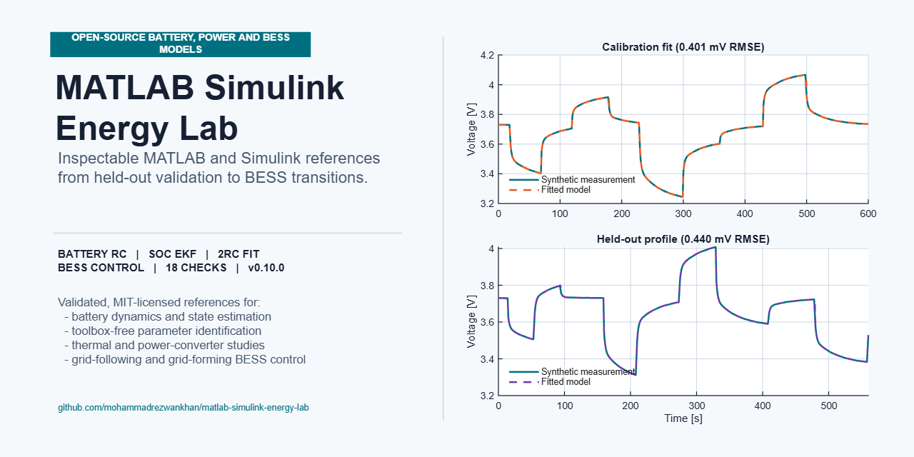
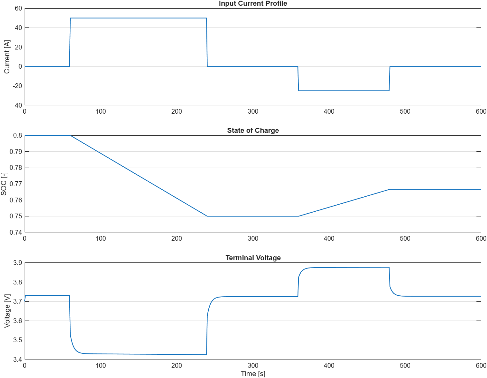
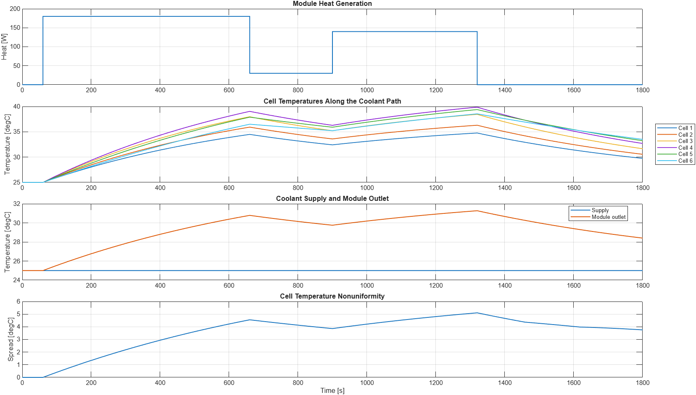
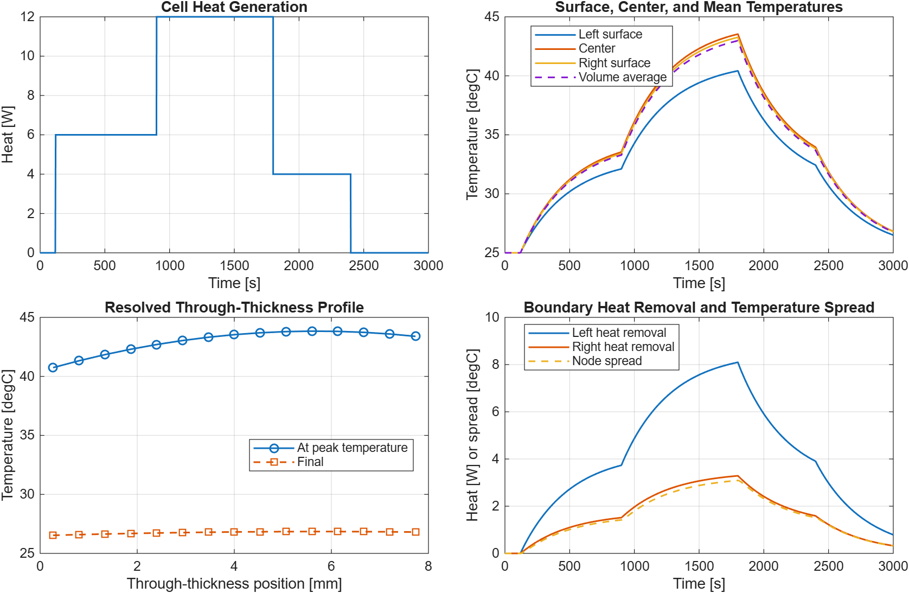
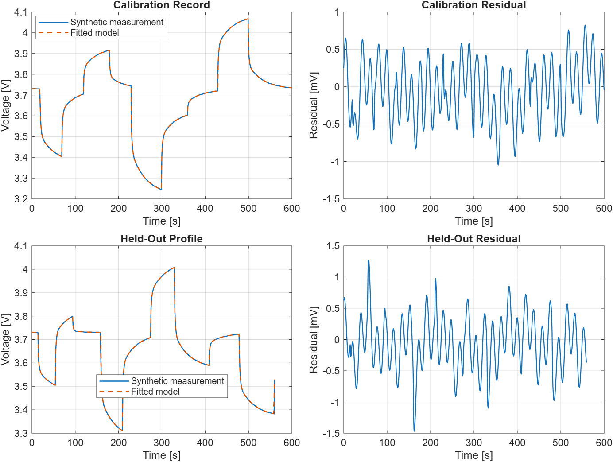
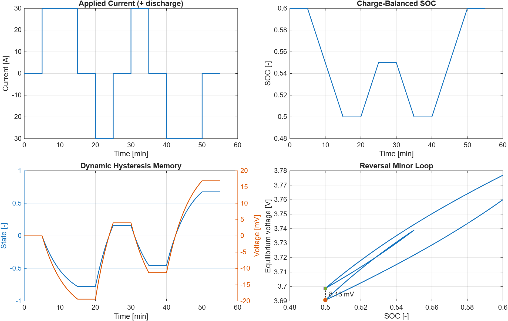
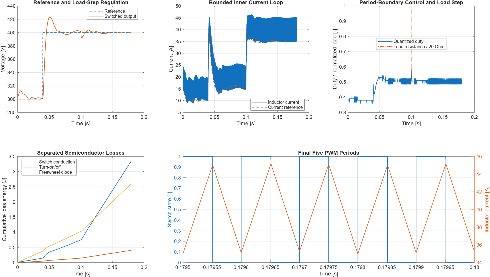
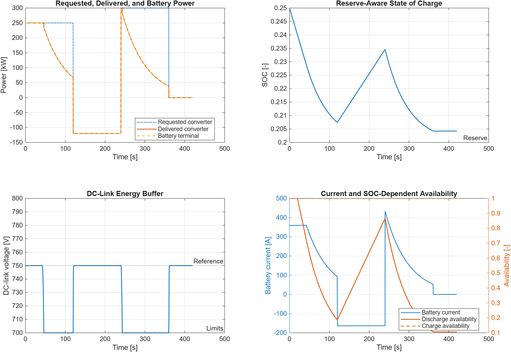
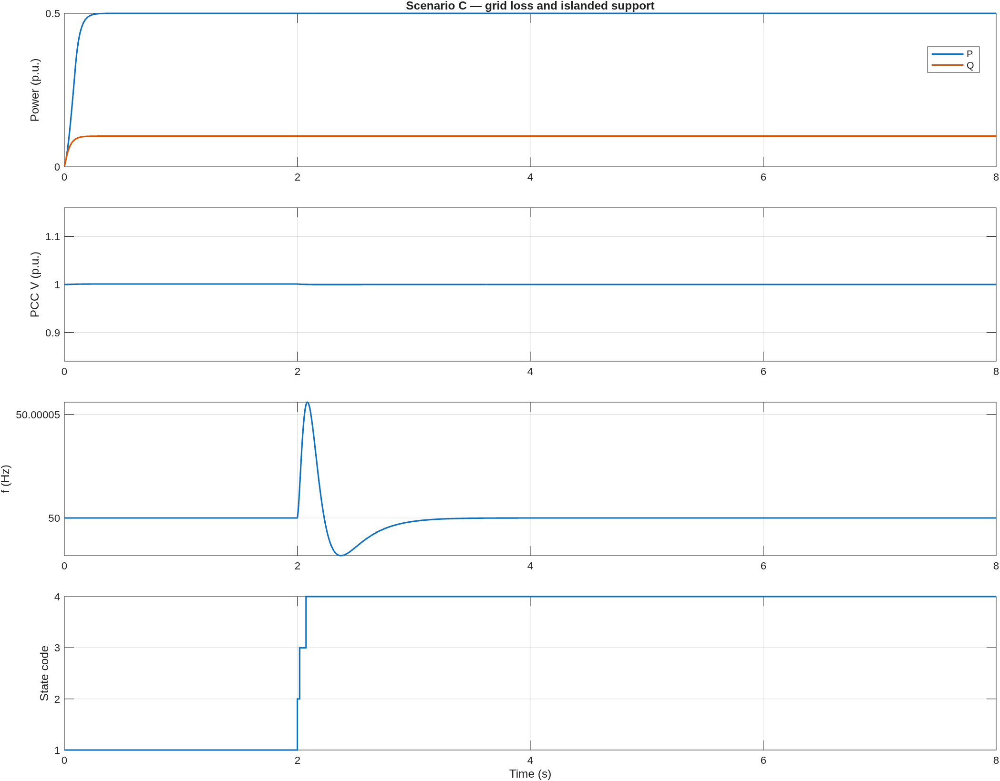

<!-- markdownlint-disable MD013 -->

# ⚡ MATLAB Simulink Energy Lab

[](https://github.com/mohammadrezwankhan/matlab-simulink-energy-lab/actions/workflows/markdown-maintenance.yml)
[](https://github.com/mohammadrezwankhan/matlab-simulink-energy-lab/actions/workflows/matlab-validation.yml)

[](https://github.com/mohammadrezwankhan/matlab-simulink-energy-lab/releases/latest)
[](LICENSE)
[](https://github.com/mohammadrezwankhan/matlab-simulink-energy-lab)
[](https://matlab.mathworks.com/open/github/v1?repo=mohammadrezwankhan/matlab-simulink-energy-lab)



> **See the equations become waveforms—and inspect every assumption in between.**

MATLAB Simulink Energy Lab is a growing collection of small, runnable, and
highly inspectable energy-system examples for students, researchers, and
hobbyists. Start with a battery RC model or an averaged converter calculation,
trace every parameter, run the checks, and extend the foundation for your own
study.

## Shareable Documentation Map

- [Start in 60 Seconds](#start-in-60-seconds) for the fastest runnable path.
- [Models at a Glance](#models-at-a-glance) for the model-to-question map.
- [Requirements](#requirements) for MATLAB and toolbox expectations.
- [Scope and Limitations](#scope-and-limitations) before reusing outputs.
- [Validation results](docs/validation-results.md) for the complete expected output.
- [Two-RC battery parameter-identification tutorial](docs/two-rc-battery-parameter-identification.md)
  for a reproducible fit-versus-held-out-validation workflow.
- [Grid-forming BESS control tutorial](docs/grid-forming-bess-control.md) for an
  executable grid-following-to-islanding-to-reconnection walkthrough.
- [Contribute a Scoped Improvement](#contribute-a-scoped-improvement) for focused changes.
- [Citation metadata](CITATION.cff) and [release notes](CHANGELOG.md) for published or shared work.

> [!TIP]
> **If a model helps you learn or saves you setup time, [star this repository](https://github.com/mohammadrezwankhan/matlab-simulink-energy-lab).**
> Your star helps more energy-engineering learners discover the lab and shows
> which open examples are worth expanding next.



## What You Can Explore

- Simulate the terminal-voltage and state-of-charge response of a first-order
  battery RC model on uniform or native irregular time grids.
- Separate fast and slow battery polarization with an exact two-RC model.
- Identify positive two-RC parameters from voltage data and test them on an
  independent held-out pulse profile.
- Generate and validate a native Simulink two-RC battery block diagram.
- Estimate real-time battery SOC and RC polarization from noisy current and
  terminal-voltage measurements with a transparent extended Kalman filter.
- Preserve charge/discharge voltage history with a one-state OCV hysteresis
  model and validate a deterministic same-SOC reversal minor loop.
- Explore how irreversible electrical losses, reversible entropic heat, and
  cooling change a lumped cell temperature and temperature-dependent resistance.
- Quantify how lumped cooling conductance changes peak temperature,
  thermal-limit exposure, and net cooling energy under one shared duty cycle.
- Resolve six cell temperatures along a serial liquid-cooling channel, including
  coolant warming, cell-to-cell conduction, and module temperature spread.
- Resolve a pouch cell's through-thickness temperature profile with a
  conservative finite-volume model, asymmetric face cooling, and hot-spot
  tracking.
- Generate and validate a native Simulink electro-thermal feedback diagram.
- Generate and validate a native Simulink battery RC block diagram.
- Validate model behavior from the command line without opening plots.
- Estimate output voltage, load current, and ripple for an averaged converter.
- Inspect bounded closed-loop voltage tracking for an averaged buck converter.
- Compare open-loop, PI, and filtered-PID load-step regulation on the same
  averaged buck plant.
- Generate and validate a native Simulink averaged buck-converter diagram.
- Exercise one unified BESS controller through grid-following, grid-forming,
  islanding, load support, synchronization, saturation, fault, and recovery
  scenarios with requirement-level traceability.
- Trace how battery SOC reserve, current capability, and DC-link energy turn a
  requested BESS converter power profile into deliverable power and curtailment.
- Trace every parameter, unit, sign convention, and limitation before extending
  a model.

## Start in 60 Seconds

Twenty established no-plot checks cover the battery, converter, and DC-side
BESS examples. The unified BESS entry point adds a focused 31-result
MATLAB/Simulink suite, so `run_all_checks` invokes 21 check entry points. All are configured
for MATLAB R2026a, and the validation workflow runs them whenever executable
model code changes.

To try the lab in a browser, use the **Open in MATLAB Online** badge above.
After the repository opens, run this from its root folder:

```matlab
addpath('examples');
run_all_checks
```

For a local command-line run:

```bash
git clone https://github.com/mohammadrezwankhan/matlab-simulink-energy-lab.git
cd matlab-simulink-energy-lab
matlab -batch "addpath('examples'); run_all_checks"
```

### Concise validation evidence

The latest signed release is [`v0.10.0`](https://github.com/mohammadrezwankhan/matlab-simulink-energy-lab/releases/tag/v0.10.0).
The verified MATLAB R2026a run on the current main branch reports:

| Evidence | Result |
| --- | --- |
| Repository regression | All 21 MATLAB and Simulink check entry points pass. |
| BESS DC reserve | 10.225 kWh delivered and 8.109 kWh curtailed discharge; SOC remains above the 0.20 reserve. |
| Switched closed-loop buck | 399.92 V final average for a 400 V target; 5.97% reference-step overshoot; 2.19% load-step undershoot. |
| Two-RC identification (synthetic) | 0.440 mV held-out voltage RMSE; 0.401 mV calibration RMSE. |
| SOC EKF (synthetic) | 0.0066 SOC RMSE; 1.581 mV posterior voltage RMSE. |
| Unified BESS focused suite | 31 focused MATLAB/Simulink results pass across eight mandatory scenarios. |
| Environment | MATLAB R2026a; Simulink is required for generated diagrams. |

These are deterministic regression checks for reduced-order educational models,
not physical-cell, hardware, or grid-code validation. In particular, the
two-RC identification benchmark uses transparent synthetic voltage records with
deterministic sensor-like perturbations, not measured cell data. See the
[full expected output and provenance](docs/validation-results.md) and
[Scope and Limitations](#scope-and-limitations) before reusing results.

To reproduce the plotted battery response above, run:

```matlab
run('examples/battery-rc-model/run_battery_rc_model.m')
```













## Models at a Glance

| Example | Question It Explores | Validation | Requirements |
| --- | --- | --- | --- |
| [Battery RC model](examples/battery-rc-model/README.md) | How do charge and discharge pulses affect SOC, terminal voltage, charge throughput, and delivered energy? | `check_battery_rc_model.m` | Base MATLAB |
| [Native Simulink battery RC](examples/battery-simulink-model/README.md) | Can a generated diagram reproduce the exact first-order battery pulse response and nonlinear OCV lookup? | `check_battery_rc_simulink_model.m` | MATLAB and Simulink |
| [Battery 2RC model and identification](examples/battery-2rc-model/README.md) | How do fast and slow polarization branches shape voltage recovery, and can their positive parameters generalize to a held-out pulse profile? | `check_battery_2rc_model.m`, `check_battery_2rc_fit.m` | Base MATLAB |
| [Native Simulink battery 2RC](examples/battery-2rc-simulink-model/README.md) | Can a generated diagram reproduce both exact battery polarization time scales? | `check_battery_2rc_simulink_model.m` | MATLAB and Simulink |
| [Battery SOC EKF](examples/battery-soc-ekf/README.md) | Can noisy voltage measurements correct a biased real-time SOC and polarization estimate? | `check_battery_soc_ekf.m` | Base MATLAB |
| [Battery OCV hysteresis](examples/battery-ocv-hysteresis/README.md) | How does charge/discharge history create different equilibrium voltages at the same SOC after a current reversal? | `check_battery_ocv_hysteresis.m` | Base MATLAB |
| [Battery SOC hysteresis EKF](examples/battery-soc-hysteresis-ekf/README.md) | How much SOC error appears when an estimator omits known OCV hysteresis under current reversals? | `check_battery_soc_hysteresis_ekf.m` | Base MATLAB |
| [Temperature-aware battery model](examples/battery-thermal-model/README.md) | How do loss, entropic heat, cooling, resistance feedback, limit exposure, and cooling-conductance sensitivity affect lumped cell temperature? | `check_battery_thermal_model.m`, `check_battery_cooling_sensitivity.m` | Base MATLAB |
| [Battery module liquid-cooling network](examples/battery-module-cooling-network/README.md) | How do nonuniform heat generation, serial coolant warming, and cell-to-cell conduction determine the hottest cell and module temperature spread? | `check_battery_module_cooling_network.m` | Base MATLAB |
| [Pouch-cell thermal gradient](examples/pouch-cell-thermal-gradient/README.md) | How do asymmetric face cooling and through-thickness conduction determine the internal hot spot and spatial temperature gradient? | `check_pouch_cell_thermal_model.m` | Base MATLAB |
| [Native Simulink battery thermal](examples/battery-thermal-simulink-model/README.md) | Can a generated discrete diagram reproduce coupled electrical, entropic, and thermal feedback sample by sample? | `check_battery_thermal_simulink_model.m` | MATLAB and Simulink |
| [Converter average model](examples/converter-average-model/README.md) | What do duty cycle and component values imply for average voltage, load current, and first-pass ripple? | `check_converter_average_model.m` | Base MATLAB |
| [Switching buck converter](examples/converter-switching-model/README.md) | How do ideal PWM switching waveforms compare with averaged voltage, current, and ripple estimates? | `check_switching_buck_converter.m` | Base MATLAB |
| [Switching closed-loop buck](examples/converter-switching-closed-loop-model/README.md) | Can a period-sampled controller regulate an explicitly switched lossy buck through reference and load steps? | `check_switching_closed_loop_buck.m` | Base MATLAB |
| [Closed-loop converter](examples/converter-closed-loop-model/README.md) | How do bounded cascaded control and open-loop, PI, and filtered-PID strategies respond to voltage and load steps? | `check_closed_loop_converter.m`, `check_converter_controller_comparison.m` | Base MATLAB |
| [Native Simulink averaged buck](examples/converter-simulink-model/README.md) | Can a generated block diagram reproduce the exact transient and lossy steady state of the averaged equations? | `check_average_buck_simulink_model.m` | MATLAB and Simulink |
| [BESS DC-link and SOC reserve](examples/bess-dc-reserve-model/README.md) | How do SOC reserve, battery-current capability, and finite DC-link energy constrain requested converter power? | `check_bess_dc_reserve.m` | Base MATLAB |
| [Unified grid-tied and grid-forming BESS control](examples/bess-unified-control/README.md) | Can one controller transition among grid-following, grid-forming, islanded support, synchronization, recovery, and fault-safe behavior with reproducible numeric evidence? | `check_bess_unified_control.m` (31 focused results) | MATLAB and Simulink |

Current release status: the battery examples, module liquid-cooling network,
and three converter references run as MATLAB scripts. Native battery RC,
battery 2RC, battery thermal, and averaged buck references additionally
generate, compile, and simulate Simulink diagrams. The unified BESS reference
generates its model, runs eight mandatory scenarios through MATLAB and
Simulink, and publishes requirements, source/assumption boundaries, and
validation artifacts.



## Why This Lab Is Inspectable

Foundational engineering models are often either too abbreviated to trust or
too elaborate to learn from. This repository takes a middle path:

- **Small models:** the governing logic fits in a short script.
- **Visible assumptions:** parameters, units, and sign conventions live beside
  the equations.
- **Repeatable checks:** no-plot scripts assert basic physical and numerical
  behavior.
- **Engineering context:** every example begins with a question and ends with
  limitations and next steps.
- **Extension-friendly:** simple baselines make it easier to add controls,
  higher-order dynamics, measured data, or Simulink implementations.

The [examples index](examples/README.md) connects each model to reproducibility,
unit consistency, validation, and review guidance. Shared conventions live in
the [modeling standards](notes/modeling-standards.md).

## Who It Is For

- **Students** learning how electrical assumptions become executable models.
- **Instructors** looking for compact examples that can be discussed and
  modified in class.
- **Researchers** who need a transparent baseline before introducing
  higher-fidelity behavior.
- **Hobbyists and engineers** exploring battery and converter fundamentals
  without a large framework.

## Project Structure

```text
matlab-simulink-energy-lab/
|-- assets/                         # Result images used in the documentation
|-- docs/                           # Full expected validation output
|-- examples/
|   |-- battery-rc-model/           # RC simulation, pulse data, and check
|   |-- battery-simulink-model/     # Generated native battery RC diagram
|   |-- battery-2rc-model/          # Fast/slow polarization model and check
|   |-- battery-2rc-simulink-model/ # Generated native two-RC diagram
|   |-- battery-soc-ekf/            # Real-time SOC and polarization estimator
|   |-- battery-ocv-hysteresis/     # Dynamic OCV history and minor loops
|   |-- battery-soc-hysteresis-ekf/ # Hysteresis-aware SOC estimation comparison
|   |-- battery-thermal-model/      # Coupled electrical-thermal cell model
|   |-- battery-module-cooling-network/ # Six-cell liquid-cooling network
|   |-- pouch-cell-thermal-gradient/ # Through-thickness finite-volume model
|   |-- battery-thermal-simulink-model/ # Generated thermal feedback diagram
|   |-- converter-average-model/    # Average-model scaffold and check
|   |-- converter-switching-model/  # Ideal PWM switching model and check
|   |-- converter-switching-closed-loop-model/ # Controlled PWM plant and check
|   |-- converter-closed-loop-model/ # Dynamic plant, controller, and check
|   |-- converter-simulink-model/   # Generated native Simulink model and check
|   |-- bess-dc-reserve-model/      # SOC reserve and DC-link availability
|   |-- bess-unified-control/        # Unified BESS modes, builder, tests, evidence
|   `-- guides/                     # Reproducibility and review notes
|-- notes/                          # Repository-wide modeling standards
|-- CONTRIBUTING.md
`-- LICENSE
```

## Requirements

- MATLAB R2026a is the verified release.
- The script-based examples and their validation checks use base MATLAB only.
- Simulink is required for the five generated block-diagram examples,
  including unified BESS control.
- No power-electronics, control, or testing toolbox is required.

If you run the examples on another MATLAB release, please share the result in
an issue so the compatibility record can grow.

## Scope and Limitations

- These examples are educational engineering references, not calibrated design
  models.
- The unified BESS controller is a transparent research translation rather
  than an exact paper reproduction. Its reduced-order averaged plant,
  transition/fault supervisor, synchronization thresholds, limits, and tuning
  include explicit project assumptions. It is not a qualified controller,
  protection system, or grid-code certification model.
- The battery models use a deliberately simple, replaceable OCV-SOC lookup
  table that must be calibrated before cell-specific use. The two-RC fitter
  requires OCV values estimated independently from the terminal-voltage fit.
- The native battery RC diagram receives the reference model's prevalidated,
  SOC-feasible current trace rather than duplicating its boundary limiter.
- The native battery 2RC diagram uses that same prevalidated current policy and
  independently integrates both polarization branches.
- The native thermal diagram reproduces a checked discrete educational model;
  it is not a spatial, safety, or thermal-runaway simulation.
- Its SOC-indexed entropic-coefficient table is illustrative, varies neither
  with temperature nor ageing, and must be replaced with measured cell data.
- The module cooling network uses lumped cell temperatures and a quasi-steady
  one-dimensional coolant path; it omits spatial gradients, pressure drop,
  manifolds, coolant transport delay, pump power, and runaway propagation.
- The pouch-cell thermal model resolves only the through-thickness direction
  with effective homogeneous properties; it omits tabs, in-plane gradients,
  layer detail, and electrochemical heat-generation nonuniformity.
- Battery current is zero-order held between supplied timestamps; RC
  polarization states are propagated exactly over each interval, and applied
  current is limited to the interval charge available before SOC reaches zero
  or one.
- The parameter-identification benchmark uses transparent synthetic voltage
  records with deterministic sensor-like perturbations; it does not claim
  validation against a physical cell.
- Ageing and cell-to-cell variation are not yet modeled. The OCV hysteresis
  example is a single-state educational reference with illustrative
  parameters, not a calibrated chemistry-specific model.
- The SOC EKF uses illustrative OCV and covariance data, assumes exact
  electrical parameters, and omits current bias, temperature, hysteresis,
  ageing, and constrained-filter theory.
- The open-loop switching converter uses ideal complementary switches. The
  switched closed-loop converter adds a constant-drop freewheel diode and
  period-sampled control, but still omits dead time, switching loss, parasitics,
  EMI, protection, sensor dynamics, and hardware validation.
- The native Simulink converter is an averaged open-loop model and therefore
  omits PWM ripple and switching events.
- The DC-side BESS reserve model uses affine OCV, constant resistance, exact
  initial SOC, and an energy-state DC link. It omits battery polarization,
  estimation error, temperature, ageing, switching conversion, protection, and
  closed-loop integration with the unified AC-side controller.
- Parameters and expected outputs must be revalidated before use with real
  cells, converters, or control designs.

## What Should Come Next?

The most useful next additions are likely to be:

- a traceable physical-cell dataset for the two-RC identification workflow;
- a source-backed semiconductor switching-loss model;
- held-out measured reversal data for the hysteresis-aware SOC estimator; or
- measured thermal-parameter identification and held-out drive-cycle validation.

[Request an example](https://github.com/mohammadrezwankhan/matlab-simulink-energy-lab/issues/new?template=example-request.md),
open a focused issue, or propose an implementation through a pull request.

## Contribute a Scoped Improvement

Choose an item from the roadmap above or browse the
[open issues](https://github.com/mohammadrezwankhan/matlab-simulink-energy-lab/issues).
Before starting substantial work, open or comment on a focused issue so the
assumptions, acceptance checks, and ownership are visible. The
[contribution guide](CONTRIBUTING.md) explains the local checks, modeling
standard, pull request workflow, and attribution policy.

## Releases and Citation

Versioned snapshots and engineering highlights are available on the
[releases page](https://github.com/mohammadrezwankhan/matlab-simulink-energy-lab/releases).
For a checksum-verifiable snapshot, download the tracked
[v0.10.0 source package](https://github.com/mohammadrezwankhan/matlab-simulink-energy-lab/releases/download/v0.10.0/matlab-simulink-energy-lab-v0.10.0.zip)
and its published [SHA-256 checksum](https://github.com/mohammadrezwankhan/matlab-simulink-energy-lab/releases/download/v0.10.0/SHA256SUMS-v0.10.0.txt).
See the [changelog](CHANGELOG.md) for the model and validation history.

If you use the lab in research, coursework, or teaching material, use GitHub's
**Cite this repository** control to export APA or BibTeX metadata. The source
metadata, including the author's ORCID, is available in
[`CITATION.cff`](CITATION.cff).

## Contributing

Contributions are welcome—especially measured-data validation, sourced
parameter sets, equivalent-circuit variants, converter topologies, automated
checks, and clearer teaching notes. Read [CONTRIBUTING.md](CONTRIBUTING.md)
before opening a pull request.

If the lab saves you time or helps you understand a model, **please leave a ⭐**.
It is the simplest way to support continued open engineering work.

## License

Released under the [MIT License](LICENSE).
