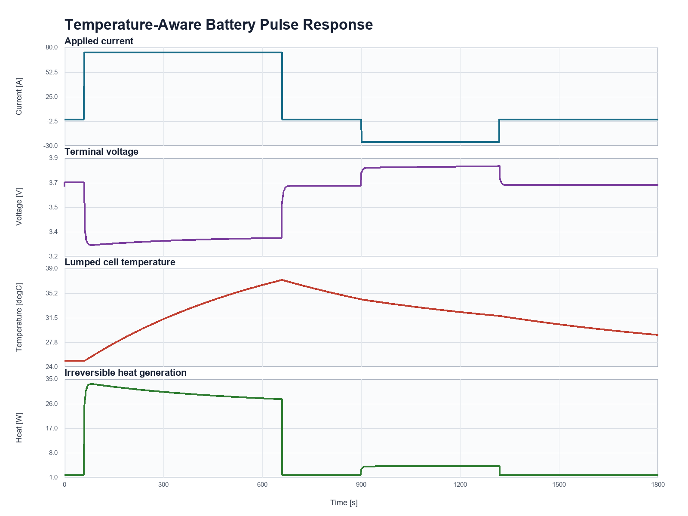

# 6. A Lumped Electrothermal Battery Model

[Chapter index](../README.md) · [Solutions](../solutions/06-electrothermal.md) · [Source map](../source-map.md)

## The question

An electrical equivalent-circuit model can reproduce a voltage transient while
remaining almost silent about temperature. That silence is dangerous in a
long-current pulse: the same resistance that produces a voltage drop also
produces heat, and the resistance then changes as the cell warms. The motivating
question in this chapter is therefore: **how can a small, inspectable model
advance SOC, polarization voltage, temperature, and heat terms together without
losing the sign conventions or the units?**

The model here is intentionally lumped. One cell has one temperature, one
ohmic resistor, and one polarization branch. It is useful for learning how an
electrical model feeds a thermal balance and for building a reproducible
simulation workflow. Its numbers are illustrative; they are not a fitted cell
or a qualification model.

## Prerequisite recap

The earlier first-order battery model used a current profile, an open-circuit
voltage (OCV), and an $R_1-C_1$ polarization branch. We retain its sign
convention: $I>0$ means discharge and $I<0$ means charge. Discharge lowers
SOC, while the terminal voltage is OCV minus the ohmic and polarization drops.
We also need two distinctions that are easy to blur:

- Celsius is convenient for reported temperatures and temperature differences,
  but an entropic term needs absolute temperature in kelvin.
- A requested current is an input. Clipping a calculated SOC state to
  $[0,1]$ prevents an invalid state; it does not retroactively limit the
  current or conserve the charge that the input requested.

## Notation and units

| Symbol | Meaning | Units |
| --- | --- | --- |
| $I$ | Applied cell current; positive on discharge | A |
| $z$ | State of charge | Fraction; multiply by 100 to display % |
| $V_{oc}$ | Open-circuit voltage | V |
| $V_{rc}$ | Polarization-branch voltage | V |
| $R_0,R_1$ | Ohmic and polarization resistance | Ω |
| $C_1$ | Polarization capacitance | F |
| $T$, $T_{amb}$ | Cell and ambient temperature | °C |
| $T_K=T+273.15$ | Absolute cell temperature | K |
| $m c_p$ | Lumped thermal capacity | J/K |
| $hA$ | Lumped heat-transfer conductance | W/K |
| $Q_{irr},Q_{rev}$ | Irreversible proxy and reversible heat | W |

The example's default thermal capacity is $1.05\,\mathrm{kg}\times
1000\,\mathrm{J/(kg\,K)}=1050\,\mathrm{J/K}$. A temperature difference has the
same numerical size in degrees Celsius and kelvin, but a temperature used in a
product such as $I T_K(dU/dT)$ must be in kelvin.

## From circuit equations to heat

The default OCV is an affine teaching relation,

$$
V_{oc}(z)=V_{nom}+k_z(z-0.5).
$$

The temperature-dependent ohmic resistance is

$$
R_0(T)=R_{0,ref}\exp\bigl(k_R(T_{ref}-T)\bigr).
$$

With the default positive $k_R$, warmer cells have smaller $R_0$. This is a
deliberate feedback loop, not a universal battery law. The polarization state
obeys

$$
\frac{dV_{rc}}{dt}=\frac{I}{C_1}-\frac{V_{rc}}{R_1C_1},
\qquad
V_{term}=V_{oc}-IR_0-V_{rc}.
$$

The example computes a model-specific irreversible heat proxy,

$$
Q_{irr}=I\bigl(IR_0+V_{rc}\bigr),
$$

and a signed reversible, or entropic, term,

$$
Q_{rev}=-I\,T_K\frac{dU}{dT}.
$$

Here $dU/dT$ is obtained by linear interpolation in the configured SOC
lookup table. The total generated heat and ambient cooling are

$$
Q_{total}=Q_{irr}+Q_{rev},
\qquad
Q_{cool}=hA(T-T_{amb}),
$$

so the lumped energy balance is

$$
(mc_p)\frac{dT}{dt}=Q_{total}-Q_{cool}.
$$

The signs are worth checking rather than memorizing. During positive
discharge, a negative lookup coefficient makes $Q_{rev}$ positive, so the
entropic term heats the cell. A positive coefficient makes it cool. Reversing
the current reverses the reversible term.

The word “irreversible” needs care here. For the canonical profile, the check
script expects this proxy to be nonnegative. Under an arbitrary reversal,
however, $V_{rc}$ can have a sign that makes $I(IR_0+V_{rc})$ negative. That
is a limitation of this model-specific proxy and its polarization bookkeeping;
it must not be generalized into the thermodynamic statement that physical
irreversible dissipation is negative.

## Source discretization

The source of truth is
`examples/battery-thermal-model/simulate_battery_thermal_model.m`. Its public
entry point is `simulate_battery_thermal_model(profile, parameters, dt_s)`.
The profile is a table with `time_s` and `current_A`; the parameter structure
comes from `battery_thermal_default_parameters`. Omitting `dt_s` preserves
strictly increasing native timestamps. Supplying a positive `dt_s` creates a
uniform grid and uses previous-value interpolation for the piecewise-constant
input. The requested final time must be an integer multiple of `dt_s`.

Here $Q_{nom}=3600Q_{\mathrm{Ah}}$ is nominal charge in A·s (coulombs), not
ampere-hours. This conversion is why the SOC equation below has no additional
factor of 3600.

Unlike the exact RC state update used in the earlier battery models, this
source deliberately advances every state with explicit Euler. For an interval
$\Delta t_n=t_{n+1}-t_n$, the implemented updates are

$$
z_{n+1}=\operatorname{clip}_{[0,1]}
\left(z_n-\frac{I_n\Delta t_n}{Q_{nom}}
\right),
$$

$$
V_{rc,n+1}=V_{rc,n}+\Delta t_n
\left(\frac{I_n}{C_1}-\frac{V_{rc,n}}{R_1C_1}\right),
$$

$$
T_{n+1}=T_n+\frac{\Delta t_n}{mc_p}
\left(Q_{total,n}-Q_{cool,n}\right).
$$

The code evaluates outputs from the state at the beginning of each interval,
then evaluates the final sample as an output-only point. It stores SOC,
polarization voltage, OCV, terminal voltage, resistance, each heat term,
cooling, net heat, and a thermal energy-balance error. This makes a plot
diagnostic rather than the only way to inspect the model.

Because this is explicit Euler, the simulator rejects intervals at or above
the following two simple limits. For a first-order mode with time constant
$\tau$, the amplification factor is $1-\Delta t/\tau$. Absolute stability
requires $|1-\Delta t/\tau|<1$, or $0<\Delta t<2\tau$. A nonnegative,
monotone decay is stricter and requires $0<\Delta t\leq\tau$; a step between
$\tau$ and $2\tau$ alternates sign while decaying and is still accepted by the
source's absolute-stability guard:

$$
\Delta t < 2R_1C_1,
\qquad
\Delta t < \frac{2mc_p}{hA}\quad(hA>0).
$$

The first default limit is $2(0.002)(2400)=9.6\,\mathrm{s}$; the second is
$2(1050)/1.2=1750\,\mathrm{s}$. The electrical limit is the restrictive
one for the one-second examples. These are stability checks, not accuracy
guarantees: a stable step can still under-resolve a pulse or a sharp thermal
transient.

## Runnable workflow

From the repository root, run the existing plot script and no-plot check:

```matlab
run(fullfile('examples', 'battery-thermal-model', ...
    'run_battery_thermal_model.m'))
run(fullfile('examples', 'battery-thermal-model', ...
    'check_battery_thermal_model.m'))
```

The `run_...` script begins with `clear; clc; close all;`; the check begins
with `clearvars; clc;`. Save work elsewhere before invoking either script if
you are using a shared MATLAB session. Each script adds its own model folder
to the path and restores the prior path with `onCleanup`.

The one-second, 75-A source/check expectation can be inspected directly:

```matlab
modelDirectory = fullfile('examples', 'battery-thermal-model');
addpath(modelDirectory);
oneStepProfile = table([0; 1], [75; 75], ...
    'VariableNames', {'time_s', 'current_A'});
oneStepParameters = battery_thermal_default_parameters();
oneStep = simulate_battery_thermal_model( ...
    oneStepProfile, oneStepParameters, 1);
fprintf('Qirr = %.7f W, Qrev = %.7f W\n', ...
    oneStep.heat_generation_W(1), oneStep.reversible_heat_W(1));
fprintf('Tnext = %.10f degC, SOCnext = %.10f, Vrcnext = %.5f V\n', ...
    oneStep.cell_temp_C(2), oneStep.soc(2), oneStep.v_rc_V(2));
```

With the default initial $z=0.8$ and $T=25\,^{\circ}\mathrm{C}$, the
reported values are $Q_{irr}=22.5\,\mathrm{W}$, $Q_{rev}=1.1180625\,\mathrm{W}$,
$T_{next}=25.0224933929\,^{\circ}\mathrm{C}$,
$z_{next}=0.7995833333$, and $V_{rc,next}=0.03125\,\mathrm{V}$.
These are source/check expectations for this exact one-step setup.



*Figure 6.1 — Existing result figure from the temperature-aware example,
showing current, terminal voltage, lumped temperature, and separated heat
terms. The plotted values are illustrative source outputs, not physical
validation.*

## Reading the canonical result

The default 30-minute profile applies 75 A for 600 s, then -25 A for 420 s,
with rest before and after. The existing check's source/check expectations are
a peak cell temperature of 36.92 °C, final temperature 28.96 °C, peak
irreversible proxy 33.31 W, reversible range -2.31 W to 1.12 W, peak total
heat 34.29 W, and final SOC 0.608. The warming pulse reduces $R_0$ through
the configured exponential relation. The charge pulse changes both the
polarization state and the sign pattern of reversible heat, while the ambient
term gradually removes energy after current falls to zero.

Look first at the balance, not just at the maximum temperature. A positive
`total_heat_generation_W` can be partly offset by positive
`cooling_power_W`; the stored `net_heat_W` is their difference. The reported
`energy_balance_error_J` should be near roundoff for the discrete update. A
large mismatch usually signals a changed sign, a time interval applied to the
wrong sample, or an input profile that was resampled differently than intended.

## Limitations and modeling choices

The cell temperature is uniform, so this chapter cannot predict a core-to-
surface gradient or a tab hot spot. The OCV law and entropic lookup are
illustrative and depend only on SOC; real chemistry can require temperature,
rate, ageing, hysteresis, and spatial dependence. Ambient temperature and
`heat_transfer_W_per_K` are fixed. The $Q_{irr}$ expression is an
equivalent-circuit proxy, especially fragile under arbitrary current
reversals. SOC clipping can hide an infeasible requested-current profile at a
bound, and the solver does not report a curtailed current or lost-charge
account. There is no ageing, thermal runaway, contact resistance, or pack
interaction. Replace the placeholders and compare against measured electrical,
temperature, and calorimetric data before making design or safety decisions.

## Exercises

### Exercise 1 — One-step hand calculation

Use the default parameters at $z_0=0.8$, $T_0=25\,^{\circ}\mathrm{C}$,
$V_{rc,0}=0$, and $I_0=75\,\mathrm{A}$ for $\Delta t=1\,\mathrm{s}$.
Calculate $R_0$, $Q_{irr}$, $Q_{rev}$, $T_1$, $z_1$, and
$V_{rc,1}$, including units.

### Exercise 2 — Stability and accuracy

Derive the explicit-Euler stability limits for the polarization branch and the
lumped cooling balance. Evaluate both limits for the default parameters. Why
does satisfying the limits not prove that a one-second step is accurate for
every possible current profile?

### Exercise 3 — Reproduce and perturb the source

Run `check_battery_thermal_model`. Then set
`oneStepParameters.entropic_coefficient_V_per_K(:) = 0` and rerun the one-
second case from the workflow. What should happen to `reversible_heat_W` and
`total_heat_generation_W` at the first sample? Identify the source assertions
that make this a checkable reproduction.

### Exercise 4 — Critical interpretation

Construct a short current reversal that leaves $V_{rc}$ positive while
$I<0$. Explain why the model's $Q_{irr}=I(IR_0+V_{rc})$ can become negative,
why that does not establish negative physical dissipation, and why SOC clipping
does not conserve the charge requested by a current that would drive SOC below
zero.
