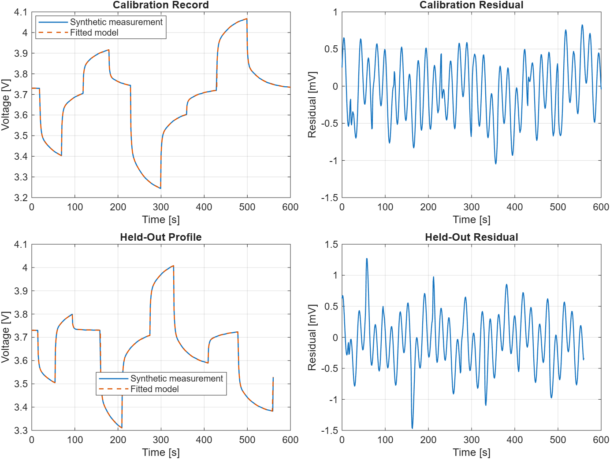

<!-- markdownlint-disable MD013 MD060 -->

# Battery 2RC Model Example

This runnable example extends the validated battery state pipeline with two
exact polarization branches: one fast and one slow. It also includes a
toolbox-free parameter-identification workflow and an independent held-out
pulse-profile check.

## Engineering Question

How does a second RC branch separate short and long terminal-voltage recovery
after battery current pulses?

How can positive `R0`, `R1-C1`, and `R2-C2` parameters be estimated from a
known-OCV voltage record without using an optimization toolbox, and do those
parameters generalize to an unseen current profile?

## Model Scope

| Element | Meaning |
|---|---|
| `OCV(SOC)` | Open-circuit voltage from the shared replaceable SOC/voltage lookup table |
| `R0` | Instantaneous ohmic resistance |
| `R1-C1` | Fast polarization branch with a default 1.8-second time constant |
| `R2-C2` | Slow polarization branch with a default 30-second time constant |
| `I_applied` | Requested current after the shared SOC-boundary limit |
| `Vt` | `OCV - I*R0 - Vrc1 - Vrc2` |

For each zero-order-held current interval and branch `k`, the simulator uses
the exact update:

```text
Vrc_k,next = exp(-dt / (Rk*Ck)) * Vrc_k
             + Rk * (1 - exp(-dt / (Rk*Ck))) * I_applied
```

The implementation calls the established one-RC simulator first, preserving
its profile validation, optional uniform resampling, OCV interpolation, SOC
charge balance, and boundary-current logic. It then propagates the second
branch from the same applied current and recomputes terminal voltage.

## Included MATLAB Files

```text
examples/battery-2rc-model/
  README.md
  battery_2rc_default_parameters.m
  simulate_battery_2rc_model.m
  build_battery_2rc_fit_scenario.m
  fit_battery_2rc_parameters.m
  evaluate_battery_2rc_fit.m
  run_battery_2rc_model.m
  run_battery_2rc_fit.m
  check_battery_2rc_model.m
  check_battery_2rc_fit.m
```

The example intentionally reuses
`../battery-rc-model/data/pulse_current_profile.csv` rather than duplicating
the canonical input.

The [native Simulink counterpart](../battery-2rc-simulink-model/README.md)
generates an inspectable block diagram and compares both numerical RC states
with this exact interval-update reference.

## How To Run

Open MATLAB, navigate to this folder, and run:

```matlab
run_battery_2rc_model
```

The plotting script shows current, SOC, terminal voltage, and both polarization
states. Run the no-plot validation with:

```matlab
check_battery_2rc_model
```

Run the identification and held-out validation example with:

```matlab
run_battery_2rc_fit
```

Run its no-plot regression check with:

```matlab
check_battery_2rc_fit
```

Expected output:

```text
Battery 2RC check passed. Final SOC: 0.767
Voltage range: 3.325 V to 3.925 V
Peak polarization: fast 0.075 V, slow 0.125 V
```

The deterministic identification check reports:

```text
Battery 2RC identification check passed.
Calibration RMSE: 0.401 mV
Held-out RMSE: 0.440 mV
Estimated time constants: 2.01 s and 33.88 s
```



## Parameter Identification

`fit_battery_2rc_parameters` accepts a table with:

| Input Column | Meaning |
|---|---|
| `time_s` | Strictly increasing measurement timestamps |
| `current_A` | Applied current using the model's positive-discharge convention |
| `ocv_V` | Independently estimated open-circuit voltage at each timestamp |
| `terminal_voltage_V` | Voltage record used for parameter fitting |

For each candidate time constant, the exact zero-order-held branch response is
computed with unit resistance. The voltage drop is then linear in the three
positive resistances:

```text
OCV - Vt = R0*I + R1*x1(tau1) + R2*x2(tau2)
```

The fitter searches logarithmically spaced ordered time constants, solves the
three-resistance least-squares problem, rejects nonpositive or ill-conditioned
candidates, and refines around the best pair. Capacitances follow from
`C1 = tau1/R1` and `C2 = tau2/R2`. This separates the nonlinear time-constant
search from the linear resistance solve and requires only base MATLAB.

`build_battery_2rc_fit_scenario` deliberately creates two different pulse
records. Only the calibration record is passed to the fitter; the second
record is held out until `evaluate_battery_2rc_fit` calculates its error. The
voltage perturbation is deterministic so CI results are reproducible.

## Fit Result Fields

| Result Field | Meaning |
|---|---|
| `parameters` | Input parameter structure with fitted `R0`, `R1`, `C1`, `R2`, and `C2` |
| `predicted_terminal_voltage_V` | Calibration voltage reconstructed by the selected candidate |
| `residual_V` | Measured minus predicted calibration voltage |
| `estimated_time_constants_s` | Ordered `[R1*C1, R2*C2]` values |
| `metrics` | RMSE, MAE, maximum error, R-squared, and design conditioning |
| `search` | Candidate count, initial bounds, grid size, and refinement settings |

## Result Fields

The result preserves the shared one-RC fields except for the single
`v_rc_V` name, which becomes explicit two-branch output:

| Result Field | Meaning |
|---|---|
| `v_rc1_V` | Fast branch polarization voltage |
| `v_rc2_V` | Slow branch polarization voltage |
| `v_polarization_V` | Sum of both branch voltages |
| `branch_time_constants_s` | `[R1*C1, R2*C2]` for the configured branches |
| `terminal_voltage_V` | Recomputed voltage after both polarization drops |

The inherited `requested_current_A`, `current_A`, `current_limited`,
`interval_s`, `cumulative_net_discharge_Ah`, and
`soc_charge_balance_error` fields retain their one-RC meanings.

## Validation Coverage

The no-plot check verifies:

- finite voltage and bounded SOC over the canonical pulse profile;
- terminal-voltage and polarization-state balances;
- exact constant-current and irregular-interval updates for both branches;
- faster relaxation of the configured R1-C1 branch;
- equality of shared current, SOC, OCV, and first-branch states with the
  established one-RC simulator;
- inherited SOC-boundary current limiting; and
- malformed second-branch parameter rejection and deterministic reruns.

The identification check additionally verifies:

- positive resistance and capacitance estimates with ordered branch time
  constants;
- bounded resistance and time-constant recovery on a known synthetic case;
- independent held-out RMSE below 1.5 mV and improvement over the initial
  parameter set;
- deterministic search results and a well-conditioned selected design matrix;
  and
- rejection of missing OCV data, non-increasing timestamps, and unexcited
  current records.

## Explicit Limitations

- Both branches begin from a rested zero-polarization state.
- Default parameters are illustrative and are not fitted to measured data.
- The included identification records are synthetic benchmarks, not physical
  cell measurements; they verify the workflow without establishing
  cell-specific accuracy.
- The fitter assumes independently estimated OCV and does not jointly identify
  capacity, OCV-SOC shape, hysteresis, initial RC states, temperature
  dependence, or measurement bias.
- Parameter identifiability still depends on record duration, pulse richness,
  sampling interval, and separation of the physical time constants.
- OCV hysteresis, ageing, self-discharge, temperature feedback, and
  cell-to-cell variation are excluded.
- The model is an equivalent-circuit teaching reference, not an
  electrochemical or pack-level design model.
- A second branch can improve transient shape but does not prove parameter
  identifiability; fit and cross-validate parameters against held-out pulse
  data before using the model for a specific cell.
