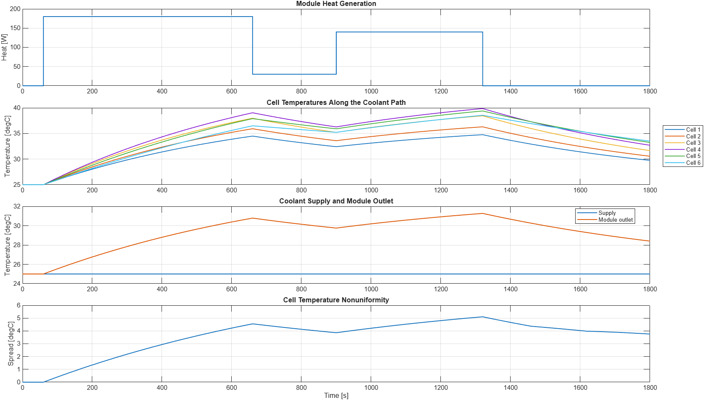

<!-- markdownlint-disable MD013 -->

# Battery Module Liquid-Cooling Thermal Network

This base-MATLAB example models six battery-cell thermal masses along a serial
liquid-cooling channel. It exposes cell-to-cell conduction, coolant warming,
heat-load nonuniformity, and module temperature spread while preserving local,
cell-level, and module-level energy balances.



## Engineering Question

How do a nonuniform cell heat load and a warming coolant stream combine to set
the hottest-cell location and temperature spread in a battery module?

## Model Topology

```text
coolant supply -> [cell 1] -> [cell 2] -> ... -> [cell 6] -> outlet
                     <---- nearest-neighbor conduction ---->
```

Each cell is a lumped thermal mass. A configured fraction of the module heat
load enters each cell. Adjacent cells exchange conductive heat, and the coolant
passes through all six cell segments in sequence.

| Element | Meaning | Illustrative value |
| --- | --- | ---: |
| `m * cp` | Thermal capacity per cell | 1050 J/K |
| `UA` | Cell-to-coolant conductance | 1.7 to 1.9 W/K |
| `Gcc` | Conductance at each cell interface | 0.25 W/K |
| `m_dot` | Coolant mass flow | 0.004 kg/s |
| `cp,cool` | Coolant specific heat | 4180 J/(kg K) |
| `Qmodule` | Applied module heat profile | 0 to 180 W |
| `Tin` | Coolant supply temperature | 25 degC |

## Governing Relations

The coolant is quasi-steady within each simulation sample. For cell segment
`i`, an effectiveness relation prevents the segment outlet from overshooting
the cell temperature:

```text
Cdot = m_dot * cp,cool
epsilon_i = 1 - exp(-UA_i / Cdot)
Qcool_i = epsilon_i * Cdot * (Tcell_i - Tcool,in_i)
Tcool,out_i = Tcool,in_i + Qcool_i / Cdot
```

The outlet from one segment becomes the inlet to the next. Each cell state
follows:

```text
Qgen_i = heat_fraction_i * Qmodule
Ccell_i * dTcell_i/dt =
    Qgen_i - Qcool_i + sum(Gcc * (Tneighbor - Tcell_i))
```

Nearest-neighbor conductive terms cancel when summed over the module. The
simulator therefore reports both per-cell and module energy-balance errors.

## Included Files

```text
examples/battery-module-cooling-network/
  README.md
  battery_module_cooling_default_parameters.m
  battery_module_cooling_default_profile.m
  simulate_battery_module_cooling_network.m
  run_battery_module_cooling_network.m
  check_battery_module_cooling_network.m
```

## Requirements

- MATLAB R2026a is the verified release.
- The example uses base MATLAB only.
- No Simulink, Simscape, or additional toolbox is required.

## How To Run

From this folder:

```matlab
run_battery_module_cooling_network
```

For deterministic no-plot validation:

```matlab
check_battery_module_cooling_network
```

Expected output:

```text
Battery module cooling-network check passed.
Peak cell temperature: 39.87 degC (cell 4 at 1320 s)
Peak cell-temperature spread: 5.10 degC
Peak coolant outlet temperature: 31.27 degC
Peak cell temperature at 3x flow: 38.01 degC
```

The simulator also accepts native irregular timestamps or a requested uniform
sample time:

```matlab
profile = battery_module_cooling_default_profile();
parameters = battery_module_cooling_default_parameters();
result = simulate_battery_module_cooling_network( ...
    profile, parameters, 1);
```

Key outputs include every cell temperature, every coolant segment inlet and
outlet temperature, cell-to-coolant heat, cell-to-cell conductive heat, module
cooling power, hottest-cell index, temperature spread, and discrete
energy-balance diagnostics.

## Flow-Rate Comparison

Because the simulator keeps coolant capacity rate explicit, a flow sensitivity
requires only one parameter change:

```matlab
highFlow = parameters;
highFlow.coolant_mass_flow_kg_per_s = ...
    3 * parameters.coolant_mass_flow_kg_per_s;
highFlowResult = simulate_battery_module_cooling_network( ...
    profile, highFlow, 1);
```

The no-plot check verifies that the canonical three-times-flow case lowers the
peak cell temperature, module temperature spread, and coolant outlet warming.

## Validation Checks

The check script verifies that:

- allocated cell heat sums to the module heat input;
- every coolant segment closes `Q = m_dot * cp * DeltaT`;
- each segment outlet is exactly the next segment inlet;
- nearest-neighbor conduction conserves module energy;
- every cell and the complete module close their discrete energy balances;
- heat-exchanger effectiveness remains between zero and one;
- the canonical load produces bounded cell heating, coolant warming, and a
  visible cell-temperature spread;
- increased coolant flow improves the canonical thermal response;
- a zero-heat isothermal case remains exactly at equilibrium;
- native irregular timestamps remain unchanged;
- row- and column-oriented parameter vectors produce identical results;
- malformed parameters, profiles, and unstable time steps are rejected; and
- repeated simulations are deterministic.

## Limitations

- Parameters and heat fractions are illustrative and are not fitted to a
  particular cell, cold plate, or module.
- Every cell has one uniform temperature; through-plane and in-plane gradients
  are not resolved.
- The coolant path is one-dimensional and quasi-steady within each time sample;
  coolant inventory, transport delay, pressure drop, pump power, and manifold
  maldistribution are omitted.
- `UA` and cell-to-cell conductance are constant and independent of
  temperature, compression, contact quality, and flow regime.
- The heat profile is prescribed rather than calculated from an electrical or
  electrochemical model.
- Phase change, boiling, ageing, thermal runaway, propagation, and safety
  controls are outside the model scope.
- Replace every placeholder with measured, geometry-specific data and validate
  against thermocouple or calorimetry measurements before design use.
