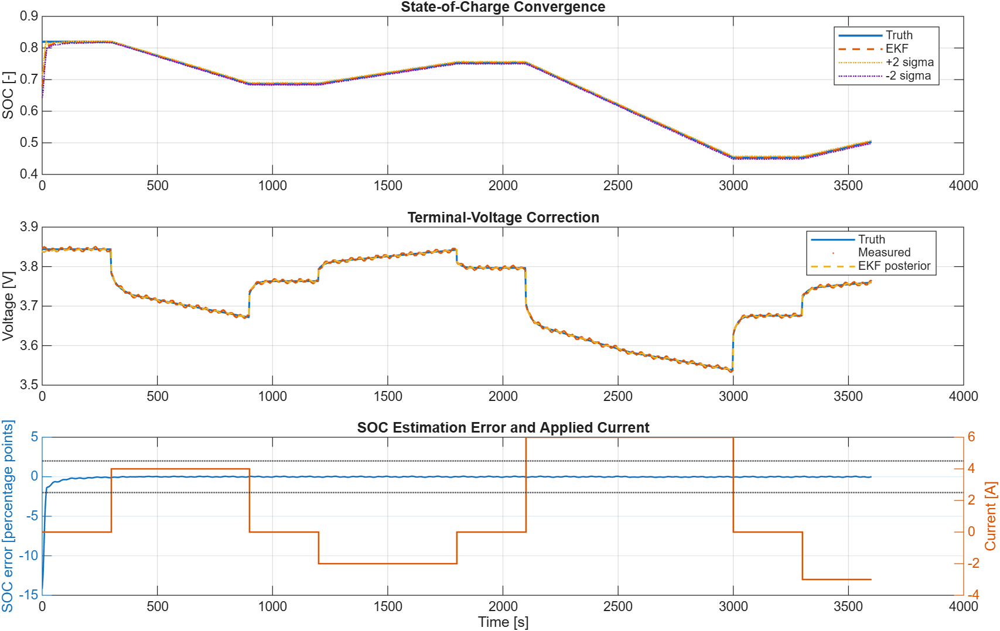

# Battery State-of-Charge EKF

## Engineering Question

How can a transparent extended Kalman filter correct a biased
state-of-charge estimate using measured current and terminal voltage?

## Model Scope

This base-MATLAB example estimates two states from a first-order battery
equivalent circuit:

```text
x = [SOC; Vrc]
SOC[k+1] = SOC[k] - I[k] * dt / (3600 * Q)
Vrc[k+1] = a * Vrc[k] + R1 * (1 - a) * I[k]
a = exp(-dt / (R1 * C1))
Vterminal[k] = OCV(SOC[k]) - R0 * I[k] - Vrc[k]
```

Positive current denotes discharge. The measurement Jacobian is
`H = [dOCV/dSOC, -1]`, where both OCV and its local slope come from the same
piecewise-linear lookup table. A Joseph-form covariance update preserves
covariance symmetry and positive-semidefinite structure under finite precision.



## Files

| File | Purpose |
|---|---|
| `battery_soc_ekf_default_scenario.m` | Defines the one-hour pulse profile, illustrative cell model, initial bias, and filter covariances. |
| `estimate_battery_soc_ekf.m` | Reusable two-state EKF for uniform or irregular measurement timestamps. |
| `simulate_battery_soc_ekf_example.m` | Generates deterministic noisy measurements from the validated RC simulator and reports estimation metrics. |
| `check_battery_soc_ekf.m` | Validates convergence, covariance structure, repeatability, irregular timestamps, and malformed-input rejection. |
| `run_battery_soc_ekf.m` | Plots SOC convergence, voltage correction, estimation error, and current. |

## Assumptions

| Quantity | Default | Unit | Role |
|---|---:|---|---|
| Capacity | 5 | Ah | Coulomb-counting scale |
| True initial SOC | 0.82 | - | Hidden reference state |
| EKF initial SOC | 0.62 | - | Deliberate 20-point initialization error |
| Ohmic resistance `R0` | 0.015 | ohm | Instantaneous voltage drop |
| Polarization resistance `R1` | 0.008 | ohm | RC branch steady drop |
| Polarization capacitance `C1` | 2500 | F | RC relaxation time |
| Assumed voltage-noise standard deviation | 6 | mV | Measurement covariance |

The deterministic voltage disturbance combines two sinusoidal components with
4 mV and 2 mV amplitudes. It is a repeatable numerical benchmark, not measured
sensor data. The OCV table is also illustrative and must be replaced before
cell-specific interpretation.

## Run

From the repository root:

```matlab
run('examples/battery-soc-ekf/run_battery_soc_ekf.m')
```

Run the no-plot validation:

```matlab
run('examples/battery-soc-ekf/check_battery_soc_ekf.m')
```

The check is also included in:

```matlab
addpath('examples')
run_all_checks
```

## Validation

The deterministic check requires:

- bounded finite SOC and finite voltage/polarization estimates;
- final SOC error below two percentage points;
- SOC RMSE below the stated benchmark limit;
- sustained entry into a two-percentage-point error band;
- symmetric positive-semidefinite posterior covariance at every sample;
- deterministic repeatability and support for irregular timestamps; and
- explicit errors for invalid time, covariance, OCV, and noise inputs.

Expected output values are recorded in the repository README after validation
on the configured MATLAB release.

## Interpretation Limits

- The plant and estimator intentionally use the same capacity, resistance, and
  OCV parameters. Parameter mismatch must be introduced and validated before
  using the example to assess robustness.
- Current-sensor bias, OCV hysteresis, temperature, ageing, and cell variation
  are omitted.
- SOC is weakly observable where `dOCV/dSOC` is small. The filter cannot create
  information that the voltage/current experiment does not contain.
- Covariances are educational tuning values, not identified sensor or process
  statistics.
- Clamping SOC to `[0, 1]` is a practical boundary treatment, not a constrained
  Kalman-filter derivation.
- This model is not a battery-management-system safety function.
