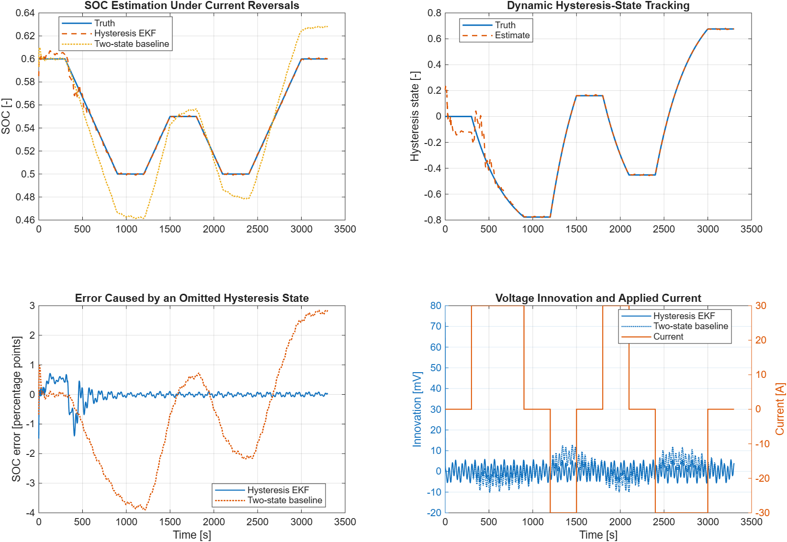

# Battery SOC Hysteresis EKF

## Engineering Question

What happens when an SOC estimator treats equilibrium voltage as a
single-valued function of SOC even though the simulated cell preserves
charge/discharge history?

This base-MATLAB example compares the repository's two-state SOC EKF with a
three-state estimator that includes the normalized dynamic hysteresis state.
Both filters receive the same deterministic noisy voltage and current record.
The comparison isolates one structural mismatch: the baseline omits OCV
hysteresis while the three-state filter models it.



## Model

The state is `x = [SOC; Vrc; h]`. Positive current denotes discharge. SOC and
RC polarization use the same exact interval updates as the existing battery
examples. The normalized hysteresis state follows

```text
target = -sign(current)
h_next = target + (h - target) *
         exp(-gamma * abs(current) * dt / (3600 * capacity))
```

and the terminal-voltage measurement is

```text
Vterminal = meanOCV(SOC) + M*h - R0*current - Vrc
H = [dOCV/dSOC, -1, M]
```

The EKF uses a Joseph-form covariance update, bounds SOC to `[0, 1]`, and
bounds the normalized hysteresis state to `[-1, 1]`. The hysteresis transition
is propagated exactly for each zero-order-held current interval, including
irregular timestamps.

## Files

| File | Purpose |
|---|---|
| `battery_soc_hysteresis_ekf_default_options.m` | Defines the three-state and two-state initial conditions and covariances. |
| `estimate_battery_soc_hysteresis_ekf.m` | Reusable SOC, polarization, and hysteresis EKF. |
| `simulate_battery_soc_hysteresis_ekf_example.m` | Generates deterministic synthetic measurements and compares both estimators. |
| `check_battery_soc_hysteresis_ekf.m` | Validates bounds, covariance structure, determinism, irregular timestamps, zero-hysteresis reduction, malformed-input rejection, and comparison thresholds. |
| `run_battery_soc_hysteresis_ekf.m` | Plots SOC, hysteresis, estimation error, and voltage innovation. |

The example reuses the validated reversal profile and plant from
`battery-ocv-hysteresis` and the existing two-state estimator from
`battery-soc-ekf`.

## Run

From the repository root:

```matlab
run('examples/battery-soc-hysteresis-ekf/run_battery_soc_hysteresis_ekf.m')
```

Run the no-plot validation:

```matlab
run('examples/battery-soc-hysteresis-ekf/check_battery_soc_hysteresis_ekf.m')
```

## Deterministic Comparison

The MATLAB R2026a regression reports:

| Metric | Hysteresis EKF | Two-state baseline |
|---|---:|---:|
| SOC RMSE | 0.0023 | 0.0203 |
| Final SOC error | +0.0005 | +0.0285 |
| Posterior voltage RMSE | 0.589 mV | 3.672 mV |

The three-state hysteresis estimate has an RMSE of `0.0482` on its normalized
state. In this controlled benchmark, explicitly modeling the known synthetic
hysteresis prevents the voltage offset from being absorbed as SOC error.

## Interpretation Limits

- The plant and three-state estimator intentionally share capacity,
  resistance, mean-OCV, and hysteresis parameters. This isolates structural
  mismatch; it is not a broad robustness study.
- The voltage record and noise are deterministic and synthetic. No physical
  cell was identified or validated.
- The compact one-state hysteresis model omits instantaneous hysteresis,
  nested-loop operators, temperature, ageing, sensor bias, and cell variation.
- The result does not prove observability or parameter identifiability for a
  measured experiment. Reversal-rich current and an independently justified
  mean-OCV relation remain necessary.
- Covariances are educational tuning values, not identified sensor or process
  statistics.
- This example is not a battery-management-system safety function.

## Next Evidence Step

A cell-specific claim would require separately measured mean-OCV data,
charge/discharge reversals across relevant SOC and temperature ranges,
calibration/held-out separation, parameter-mismatch sensitivity, and a
documented sensor-error model.
