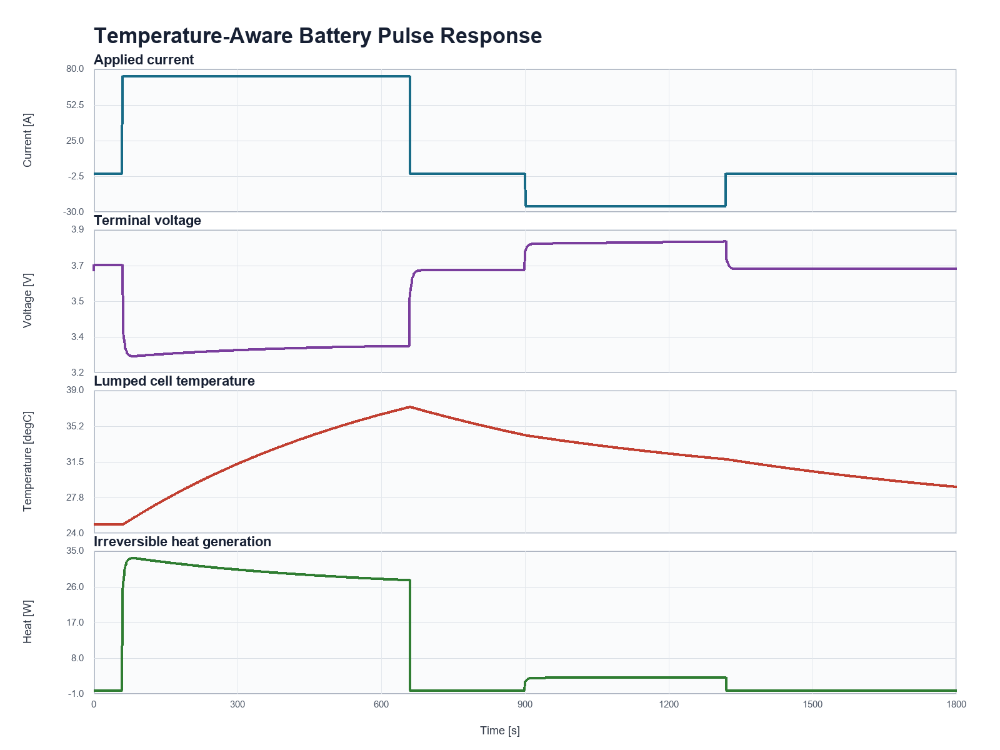

# Temperature-Aware Battery Model

This runnable MATLAB example couples a first-order battery equivalent circuit
to a lumped thermal balance. It shows how current-dependent losses, cooling,
and temperature-dependent resistance interact during charge and discharge.



## Engineering Question

How does a simplified cell temperature evolve during a pulse-current cycle,
and how can that temperature feed back into the battery's ohmic resistance?

## Model Scope

| Element | Meaning | Placeholder Value |
|---|---|---:|
| `R0(T)` | Temperature-dependent ohmic resistance | 4 mOhm at 25 degC |
| `R1-C1` | Transient polarization branch | 2 mOhm, 2400 F |
| `m * cp` | Lumped thermal capacity | 1050 J/K |
| `hA` | Lumped conductance to fixed ambient | 1.2 W/K |
| `Qdot` | Irreversible heat from equivalent-circuit losses | `I * (I*R0 + Vrc)` |
| `Tamb` | Fixed ambient temperature | 25 degC |

The resistance relation is an inspectable educational approximation:

```text
R0(T) = R0_ref * exp(kR * (Tref - T))
```

The thermal state uses a single-node energy balance:

```text
(m * cp) * dT/dt = Qdot - hA * (T - Tamb)
```

## Included MATLAB Files

```text
examples/battery-thermal-model/
  README.md
  run_battery_thermal_model.m
  check_battery_thermal_model.m
```

## Requirements

- MATLAB R2026a is the verified release.
- The example uses base MATLAB only.
- No Simulink or additional toolbox is required.

## How To Run

From MATLAB, navigate to this folder and run:

```matlab
run_battery_thermal_model
```

For a lightweight no-plot validation:

```matlab
check_battery_thermal_model
```

Expected output:

```text
Battery thermal check passed.
Peak cell temperature: 37.32 degC
Final cell temperature: 28.95 degC
Peak irreversible heat: 33.32 W
Final SOC: 0.608
```

## Validation Checks

The no-plot script verifies that:

- SOC remains in the physical interval `[0, 1]`;
- the pulse case heats above ambient but remains below 45 degC;
- ohmic resistance decreases as temperature rises;
- irreversible heat remains nonnegative for the defined current profile;
- terminal voltage responds to the applied pulses; and
- integrated net heat matches the change in lumped thermal energy.

## Limitations

- Parameters are illustrative and are not fitted to a specific cell.
- The model has one uniform cell temperature and no spatial gradients.
- Ambient temperature and heat-transfer conductance are fixed.
- Reversible entropic heat is excluded.
- Heat capacity and electrical parameters other than `R0` are constant.
- Aging, hysteresis, thermal runaway, contact resistance, and pack-level
  interactions are outside the model scope.
- Results must not be used for cell qualification or safety decisions without
  calibration and validation against measured data.
