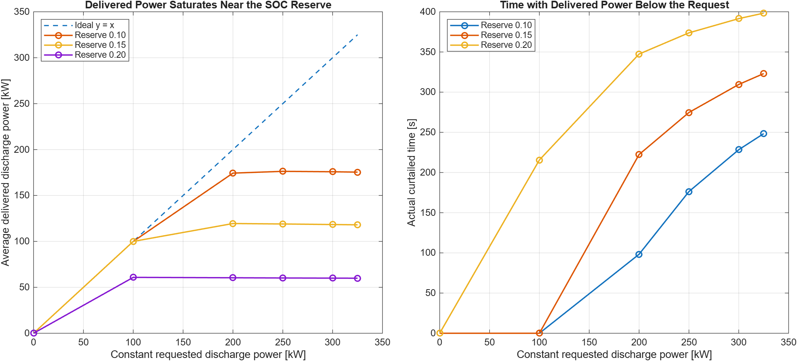
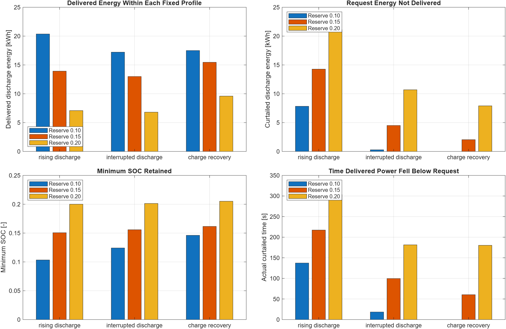

# BESS DC-Link and SOC Reserve Model

This Base-MATLAB benchmark makes the battery and DC-side availability behind a
BESS converter explicit. It connects an affine OCV-SOC battery, internal loss,
charge/discharge current limits, SOC reserve taper, a finite DC-link capacitor,
and requested-versus-delivered converter power without requiring Simulink.

## Engineering Question

How do battery SOC reserve, current capability, and finite DC-link energy turn
an AC-side power request into a smaller deliverable-power envelope?

## Sign Convention and Equations

Converter and battery power are positive during discharge toward the AC-side
plant and negative while charging. Battery current is positive on discharge:

```text
Voc(z) = V0 + kz
Pbat = (Voc,avg - R0 Ibat) Ibat
z(k+1) = z(k) - Ibat dt / (3600 QAh)
Edc(k+1) = Edc(k) + (Pbat - Pconverter) dt
Vdc = sqrt(2 Edc / Cdc)
```

Because OCV is affine and current is constant over one interval, the simulator
uses the exact interval-average OCV. The resulting current solution includes
the small OCV change during the interval rather than treating terminal power
and SOC integration as unrelated calculations.

## Reserve and DC-Link Policy

- Discharge-current availability tapers linearly from full capability to zero
  between `SOC = 0.24` and the `0.20` reserve.
- Charge-current availability similarly tapers near the `0.90` upper SOC bound.
- A proportional DC-energy correction asks the battery to restore the 750 V
  DC-link reference while following the converter request.
- Battery power is clipped by SOC-dependent charge/discharge current limits.
- The DC-link capacitor supplies or absorbs the remaining short transient.
  Converter power is curtailed before the configured 700/800 V energy bounds
  can be crossed.

This policy is intentionally inspectable. It is not a vendor BMS, DC/DC
controller, or site energy-management algorithm.

## Starter Parameters

| Parameter | Value | Unit |
| --- | ---: | --- |
| Battery capacity | 200 | Ah |
| Initial / reserve / maximum SOC | 0.25 / 0.20 / 0.90 | - |
| OCV law | 700 + 100 SOC | V |
| Internal resistance | 0.08 | Ohm |
| Discharge / charge current limit | 500 / 300 | A |
| DC-link capacitance | 0.8 | F |
| DC-link reference / limits | 750 / 700 to 800 | V |
| Sample time / duration | 0.1 / 420 | s |
| Converter request | +250, -120, +300, 0 | kW |
| Request breakpoints | 0, 120, 240, 360 | s |

## Run

```matlab
run_bess_dc_reserve
```

For the no-plot regression check:

```matlab
check_bess_dc_reserve
```

For the illustrative reserve-floor versus constant-request sensitivity:

```matlab
run_bess_dc_reserve_envelope
```

For the prescribed dynamic-profile sensitivity:

```matlab
run_bess_dc_reserve_profile_sensitivity
```

[Open the prescribed dynamic-profile runner in MATLAB Online](https://matlab.mathworks.com/open/github/v1?repo=mohammadrezwankhan/matlab-simulink-energy-lab&file=examples/bess-dc-reserve-model/run_bess_dc_reserve_profile_sensitivity.m).

Expected output:

```text
BESS DC reserve check passed.
SOC: minimum 0.2042, final 0.2042
DC-link voltage: 700.00 V to 750.00 V
Delivered/curtailed discharge energy: 10.225 / 8.109 kWh
Accepted charge energy: 4.000 kWh
SOC-taper active / curtailed time: 219.9 / 190.7 s
Peak discharge/charge current: 432.9 / 163.5 A
```


The check verifies state, voltage, and current bounds; exact terminal-power
consistency; measurable charge recovery; reserve curtailment; battery and
DC-link energy conservation; doubled-grid convergence; and malformed-input
rejection.

## Constant-Request Reserve Sensitivity

The sensitivity runner holds the battery, current limit, DC-link parameters,
420-second horizon, and constant-request profile shape fixed. It sweeps three
illustrative minimum reserve levels (`0.10`, `0.15`, and `0.20`) against six
constant discharge requests from `0` to `325 kW`.

Across the 18 deterministic cases, the maximum average delivered power is
`176.277 kW` and maximum curtailed discharge energy is `30.924 kWh`. Delivered
energy is intentionally not asserted to increase monotonically with request:
after the reserve taper is active, higher current can add loss while delivered
power is already saturated. The check instead verifies the pre-registered
curtailment, SOC-taper exposure, reserve-order, state-bound, energy-closure,
determinism, and doubled-grid relations.



This is a reduced-order DC-side sensitivity map under one fixed-duration
synthetic request family. It is not a cell or pack safe-operating area, BMS
safety limit, inverter rating, grid-service guarantee, site dispatch result,
or hardware/grid-code validation.

## Prescribed Dynamic-Profile Sensitivity

The dynamic-profile runner evaluates three fixed 420-second requests at the
same `0.1 s` grid and three illustrative reserve floors (`0.10`, `0.15`, and
`0.20`). `rising_discharge` uses three increasing discharge plateaus,
`interrupted_discharge` separates two discharge blocks with idle intervals,
and `charge_recovery` inserts a prescribed `-120 kW` charge interval between
two discharge blocks. The profiles are intentionally not energy-normalized.

| Profile ID | Breakpoints [s] | Requested converter power [kW] |
| --- | --- | --- |
| `rising_discharge` | `0, 140, 280` | `150, 250, 325` |
| `interrupted_discharge` | `0, 105, 210, 315` | `300, 0, 300, 0` |
| `charge_recovery` | `0, 105, 210, 315` | `300, -120, 300, 0` |

Across the nine deterministic cases, delivered discharge energy ranges from
`6.806` to `20.364 kWh`, and actual curtailment time ranges from `0.0` to
`303.4 s`. The check verifies request-energy partitions, current/SOC/DC-link
bounds, exact zero-request identity, deterministic reruns, doubled-grid
convergence, malformed-input rejection, and both summary and independently
state-derived energy closure. The runner labels horizon-average and active-
window quantities separately.



Reserve ordering is evaluated only within each unchanged request profile.
Values across different profiles are descriptive and must not be interpreted
as an isolated profile-shape law, dispatch comparison, or general operating
envelope. This remains a reduced-order synthetic DC-side regression—not pack
SOA, BMS safety, inverter capability, AC-control integration, grid service,
site dispatch, or hardware/grid-code validation.

## Relationship to Unified BESS Control

The [unified BESS control example](../bess-unified-control/README.md) accepts
`available_power_pu` and `dc_voltage_pu` as replaceable DC-side boundary inputs.
This benchmark explains one transparent way those quantities can arise from
SOC, current capability, and DC-link energy. The two examples remain separate
so neither implies an unvalidated closed-loop battery-to-grid integration.

## Explicit Limitations

- OCV is affine and internal resistance is constant. Polarization, hysteresis,
  temperature, ageing, cell imbalance, estimation error, and contactor states
  are omitted.
- SOC is coulomb-counted from an exact initial value; capacity and current bias
  uncertainty are omitted.
- The DC link is an energy state, not a switching converter. PWM, DC/DC
  dynamics, semiconductor loss, ripple, protection, and controls are omitted.
- Requested power is a deterministic synthetic profile. It is not a measured
  duty cycle, market dispatch, or grid-service requirement.
- Reserve taper and controller gain are project assumptions, not source-backed
  production settings or safety limits.
- Results are numerical regression evidence for an educational model, not
  cell, pack, inverter, grid-code, or site validation.
