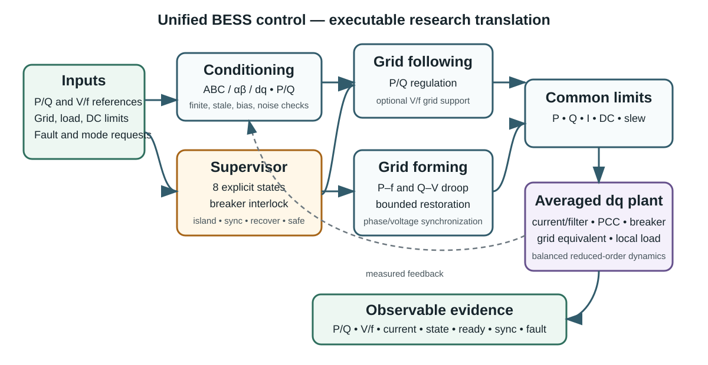
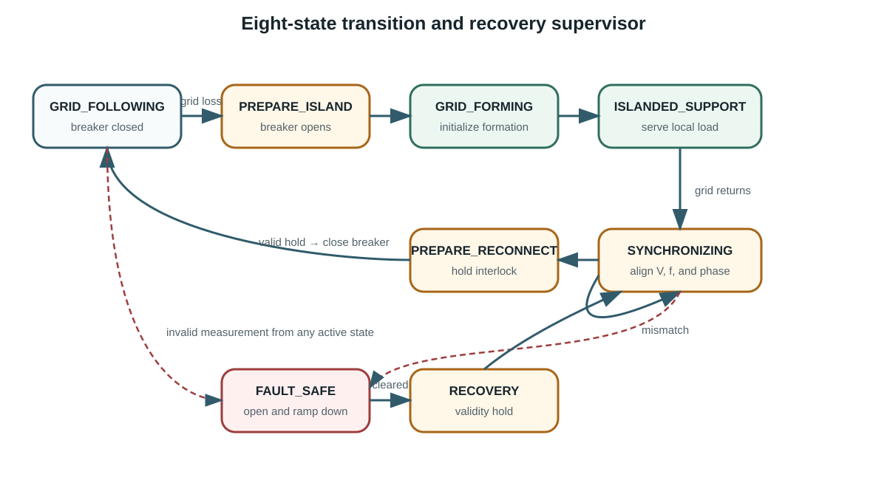

# Architecture

## Executable boundary

The generated Simulink model is an executable shell around readable MATLAB
kernels. The shell supplies a deterministic 16-signal scenario profile, runs
the unified controller and averaged plant at a 5 ms discrete sample time,
exposes 20 named signals, and logs one vector for parity and scenario scoring.

`build_bess_unified_control_model.m` creates this shell from an empty model.
The builder validates the sample grid, configures `FixedStepDiscrete`, installs
the model-workspace profile, compiles the model, and saves a disposable `.slx`.

## Data flow

1. `bess_validation_scenarios.m` defines deterministic external conditions.
2. `bess_condition_measurement.m` applies invalid, stale, bias, and noise
   behavior and validates the measurement.
3. Clarke/Park and P/Q utilities provide a common measurement frame.
4. `bess_controller_step.m` advances the explicit eight-state supervisor.
5. The active mode generates P/Q or voltage/frequency commands.
6. `bess_limit_pq.m` applies active, reactive, current, and available-power
   constraints; slew logic bounds command movement.
7. `bess_plant_step.m` advances reduced-order P/Q/V/f dynamics and breaker
   state.
8. All observable measurements, commands, flags, and mismatch metrics are
   logged and scored.

## Plant abstraction

The publication models the BESS as an ideal power source and omits detailed
converter-grid dynamics. This executable plant is likewise averaged, but adds
explicit d/q current states as a reduced-order current-control/filter
equivalent plus finite voltage/frequency dynamics. When the breaker is closed,
grid voltage, frequency, and phase anchor the PCC. When it is open, commanded
voltage and frequency establish the islanded PCC while converter current
supplies the local load demand.

Balanced three-phase voltage/current vectors are reconstructed from the
dynamic d/q states for independent transform and power checks. The plant omits
PWM, semiconductor loss,
harmonics, transformer and filter electromagnetic states, electrochemical
battery states, detailed DC-link dynamics, and protection coordination.

## Controller separation

The controller has four reviewable concerns:

- conditioning and measurement validity;
- state supervision and breaker interlocking;
- grid-following or grid-forming reference generation; and
- common limits, slew bounds, and status reporting.

This separation makes it possible to replace the reduced-order plant, tune
control laws, or add higher-fidelity inner loops without rewriting the
transition and evidence framework.

The generated Simulink shell intentionally invokes the same reviewed kernels
as the direct MATLAB runner; its parity test checks model construction,
workspaces, timing, logging, and wiring. Independent analytic tests—not wrapper
parity—establish transform orientation, P/Q sign, droop/slew, support sign,
limiting, synchronization thresholds, bases, and bounded restoration states.

The paper's separate VSG branch is documented but excluded because its swing
equation, inertia, AVR, governor, and gains are not published sufficiently for
a defensible executable reproduction.

## Supervisor

The state machine is implemented in deterministic MATLAB logic rather than
Stateflow, so the required dependency remains MATLAB plus Simulink. The paper
does not validate islanding/reconnection; this supervisor is a documented
project extension.
