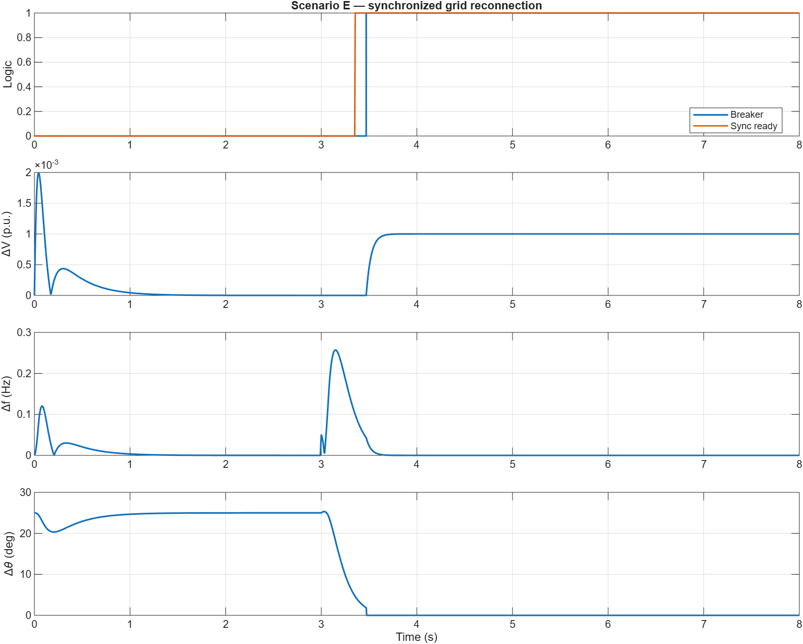
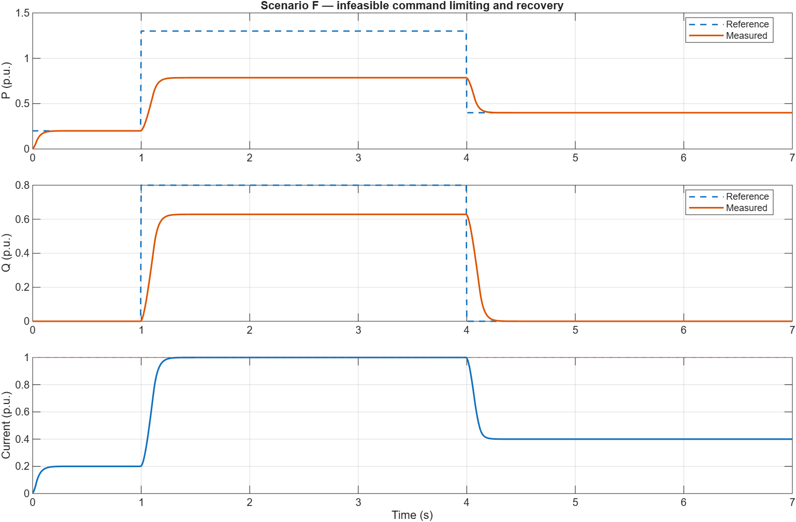

<!-- markdownlint-disable MD013 -->

# Unified BESS Control Validation Report

> [!NOTE]
> This is the preserved `v0.9.0` unified-BESS publication record. For the
> repository's current release and commit-specific CI provenance, use the
> root [validation results](../../../docs/validation-results.md) and
> [validation manifest](../../../docs/validation-manifest.md).

## Result

All eight mandatory scenarios and all focused MATLAB/Simulink tests pass with
MATLAB R2026a Update 4 and Simulink. The model is a transparent engineering
translation evaluated against the documented project gates; it is not an exact
paper reproduction or a grid-code qualification result.

## Commands

Focused suite:

```bash
matlab -batch "addpath('examples/bess-unified-control'); run('examples/bess-unified-control/check_bess_unified_control.m')"
```

Complete repository regression:

```bash
matlab -batch "addpath('examples'); run_all_checks"
```

Evidence regeneration:

```bash
matlab -batch "addpath('examples/bess-unified-control'); generate_bess_validation_evidence('COMMIT_SHA')"
```

## Environment and dependencies

| Item | Verified value |
| --- | --- |
| MATLAB | 26.1.0.3312084 (R2026a) Update 4 |
| Required products | MATLAB, Simulink |
| Solver | Fixed-step discrete |
| Sample time | 0.005 s |
| Scenario count | 8 |
| Focused test results | 31 |
| Generated-model source | `build_bess_unified_control_model.m` |

The public CI run tied to the release commit is the authoritative
commit-specific validation record. `results.json` is regenerated from the
same model and includes its source-commit field.

Historical `v0.9.0` publication evidence:

- merge commit: `a77d8cda99204b197e479d11a10c069ea13995de`;
- release tag: `v0.9.0`;
- default-branch CI run:
  <https://github.com/mohammadrezwankhan/matlab-simulink-energy-lab/actions/runs/30364739430>;
- public release:
  <https://github.com/mohammadrezwankhan/matlab-simulink-energy-lab/releases/tag/v0.9.0>;
  and
- executable package SHA-256:
  `9b009ad23f02bbefd238f22abf65a1c878bf2261ce3e46686c191fd9a1eee006`.

## Scenario results

| ID | Pass | Maximum current (p.u.) | Voltage range (p.u.) | Frequency range (Hz) | Main checked behavior |
| --- | --- | ---: | --- | --- | --- |
| A | PASS | 0.8980 | 0.9960–1.0020 | 50.0000–50.0000 | P/Q tracking |
| B | PASS | 1.0000 | 0.1360–1.0000 | 49.5002–50.0000 | disturbance recovery |
| C | PASS | 0.5099 | 0.9999–1.0010 | 50.0000–50.0001 | grid-loss transition |
| D | PASS | 0.8000 | 1.0000–1.0000 | 49.9067–50.1203 | islanded load support |
| E | PASS | 0.5101 | 0.9996–1.0020 | 49.9698–50.3072 | synchronization/reconnection |
| F | PASS | 1.0000 | 1.0000–1.0063 | 50.0000–50.0000 | saturation and recovery |
| G | PASS | 0.5000 | 1.0000–1.0000 | 50.0000–50.7781 | fault-safe recovery |
| H | PASS | 0.8181 | 1.0000–1.0080 | 50.0000–50.0000 | DC availability boundary |

Scenario B intentionally applies the paper-discussed 0% source-voltage dip.
Its voltage minimum is therefore not assessed against the normal-transition
0.85 p.u. gate. The scorer instead asserts source-case recovery above 50% and
then steady recovery. Scenario H intentionally requests 1.0 p.u. P while only
0.2 p.u. is available, so its final reference error is expected and the
acceptance assertion is the available-power command bound.

## Acceptance summary

- finite real outputs: PASS;
- configured current limit plus 1% numerical tolerance: PASS;
- grid-following P/Q steady error at most 2%: PASS;
- grid-forming voltage steady error at most 2%: PASS;
- grid-forming frequency steady error at most 0.1%: PASS;
- normal-transition V/f envelopes: PASS;
- ordered supervisor state transitions: PASS;
- breaker synchronization guard and validity flags: PASS;
- saturation, bounded internal behavior, and recovery: PASS;
- fault-safe opening and deterministic recovery: PASS;
- clean model generation, compilation, and execution: PASS;
- repeat-run determinism: PASS;
- generated Simulink shell/shared-kernel signal parity across A–H: PASS; and
- requirement rows with implementation/test/status coverage: PASS.

## Independent calculation evidence

The focused suite independently constructs balanced ABC voltage and current
vectors and verifies Clarke/Park orientation and analytic P/Q. It computes the
forming droop/slew result outside the controller before comparison, checks the
P/Q/current capability boundary, checks synchronization thresholds, verifies
base-value formulas, verifies that reactive grid support raises rather than
lowers PCC voltage, and exercises forming restoration clamp/unwind behavior.
The generated-model comparison checks the shell's timing, wiring, workspaces,
logging, and shared-kernel execution; it is not claimed as an independent
second controller implementation.

## Model regeneration

The test suite builds the model in two empty temporary directories, compiles
both, and compares their block paths, solver type, solver name, fixed step, and
Outport count. It then executes the first model. The `.slx` binary is not used
as source because package metadata can differ even when model structure is
equivalent.

## Original visual evidence






These figures are generated from logged Simulink results. They support review;
numeric assertions decide pass/fail.

## Warnings and dispositions

- The evidence generator ran Code Analyzer over all 31 example MATLAB files
  and captured `message_count: 0` in `results.json`.
- The initial MATLAB tool bridge disconnected before running a command; direct
  non-interactive R2026a execution was used and is not a model warning.
- The optional external model-audit wrapper was unavailable in its MATLAB
  session (`Unrecognized function or variable 'model_check'`); model update,
  compilation, topology checks, execution, and parity were performed by the
  repository's direct R2026a tests.
- The obsolete Interpreted MATLAB Function block is unavailable in R2026a; the
  builder uses the supported MATLAB Function block discovered from the
  installed Simulink library.
- The source paper's conflicts in power values, signs, and units are preserved
  in the source ledger and are not treated as executable parameters.

## Scope statement

Results apply only to the documented reduced-order balanced averaged plant,
starter parameters, and deterministic scenarios. See
`../docs/limitations.md` before interpreting or extending the model.
