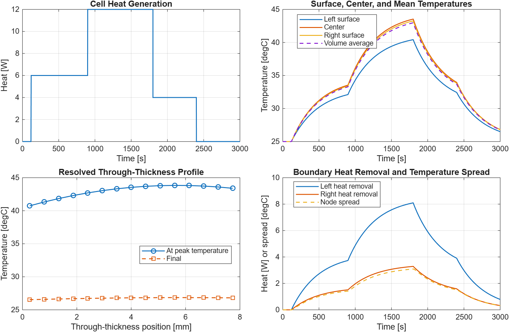

<!-- markdownlint-disable MD013 -->

# Pouch-Cell Through-Thickness Thermal Gradient

This base-MATLAB example resolves a pouch cell as a one-dimensional slab of
finite thermal volumes. It connects uniform internal heat generation to
through-thickness conduction and independent convection conditions at the two
broad faces.



## Engineering Question

When the two pouch-cell faces see different cooling conditions, where does the
hot spot move, how large is the through-thickness temperature gradient, and
does the numerical model conserve energy?

## Model Topology

```text
left fluid <-> [CV 1] - [CV 2] - ... - [CV N] <-> right fluid
                  uniform volumetric heat generation
```

The default cell uses 15 equal, cell-centered control volumes.

| Element | Meaning | Illustrative value |
| --- | --- | ---: |
| `L` | Cell thickness | 8 mm |
| `A` | Broad-face area | 0.015 m2 |
| `rho` | Effective density | 2200 kg/m3 |
| `cp` | Effective specific heat | 900 J/(kg K) |
| `kz` | Effective through-plane conductivity | 0.45 W/(m K) |
| `hleft` | Left-face heat-transfer coefficient | 35 W/(m2 K) |
| `hright` | Right-face heat-transfer coefficient | 12 W/(m2 K) |
| `Qcell` | Applied whole-cell heat profile | 0 to 12 W |

These values are deliberately illustrative. A real layered pouch cell is
anisotropic and requires geometry-, compression-, SOC-, and
temperature-qualified properties.

## Finite-Volume Relations

For node `i`, the thermal state follows:

```text
Cnode * dTi/dt =
    Qcell / N
    + Gz * (Ti-1 - Ti)
    + Gz * (Ti+1 - Ti)
```

where:

```text
Cnode = rho * cp * A * dx
Gz = kz * A / dx
```

At each boundary, the half-control-volume conduction resistance and convection
resistance are combined:

```text
Gboundary = A / (dx / (2*kz) + 1/h)
Qboundary = Gboundary * (Tboundary-node - Tfluid)
```

Positive boundary heat denotes heat removed from the cell. Internal interface
flows cancel exactly when all control-volume balances are summed.

## Included Files

```text
examples/pouch-cell-thermal-gradient/
  README.md
  pouch_cell_thermal_default_parameters.m
  pouch_cell_thermal_default_profile.m
  simulate_pouch_cell_thermal_model.m
  run_pouch_cell_thermal_model.m
  check_pouch_cell_thermal_model.m
```

## Requirements

- MATLAB R2026a is the verified release.
- The example uses base MATLAB only.
- No Simulink, Simscape, PDE, or additional toolbox is required.

## How To Run

From this folder:

```matlab
run_pouch_cell_thermal_model
```

For deterministic no-plot validation:

```matlab
check_pouch_cell_thermal_model
```

Expected output:

```text
Pouch-cell thermal-gradient check passed.
Peak node temperature: 43.83 degC at 5.60 mm and 1800 s
Peak through-thickness node spread: 3.09 degC
Symmetric steady center error: 0.003 degC
Medium-to-fine grid center difference: 0.0024 degC
```

The simulator accepts native irregular timestamps or a requested uniform
sample time:

```matlab
profile = pouch_cell_thermal_default_profile();
parameters = pouch_cell_thermal_default_parameters();
result = simulate_pouch_cell_thermal_model( ...
    profile, parameters, 0.5);
```

Key outputs include every node temperature, inferred surface temperatures,
center and volume-average temperature, every interface heat flow, both
boundary heat-removal rates, hot-spot position, spatial temperature spread,
and node-level and whole-cell energy-balance diagnostics.

## Validation Checks

The no-plot script verifies that:

- uniform heat allocation sums to the prescribed whole-cell heat;
- internal interface heat cancels from the whole-cell balance;
- every node and the complete slab close their discrete energy balances;
- inferred surface temperatures close both convection relations;
- asymmetric cooling creates a bounded gradient and shifts the hot spot;
- a zero-heat isothermal case remains exactly at equilibrium;
- equal boundary conditions preserve mirror symmetry;
- a long symmetric run approaches the continuous slab steady-state solution;
- center temperature converges as the spatial grid is refined;
- native irregular timestamps remain unchanged;
- malformed inputs and unstable explicit time steps are rejected; and
- repeated simulations are deterministic.

## Continuous Steady-State Reference

For uniform volumetric heat `qdot`, equal convection coefficient `h` on both
faces, and common fluid temperature `Tinf`, the continuous symmetric slab has:

```text
Tcenter - Tinf = qdot * L / (2*h) + qdot * L^2 / (8*kz)
```

The check compares the finite-volume transient against this independent
reference after the thermal response has settled.

## Limitations

- Parameters are educational placeholders and are not fitted to a particular
  cell or cooling plate.
- The model resolves only the through-thickness direction. It omits in-plane
  gradients, tabs, edge cooling, current-collector detail, and layer-by-layer
  properties.
- Heat generation is spatially uniform and externally prescribed rather than
  calculated from an electrochemical model or calorimetry data.
- Material properties and heat-transfer coefficients are constant.
- Contact resistance is represented only through the effective boundary
  coefficients and is not separated from convection.
- The explicit solver rejects time steps outside a conservative monotonic
  stability bound; perform temporal and spatial refinement studies for new
  parameter sets.
- Phase change, gas generation, thermal runaway, propagation, and safety
  controls are outside the model scope.
- Calibrate and validate against spatial temperature or heat-flux measurements
  before using the model for design or safety decisions.
